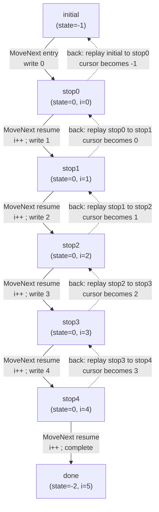
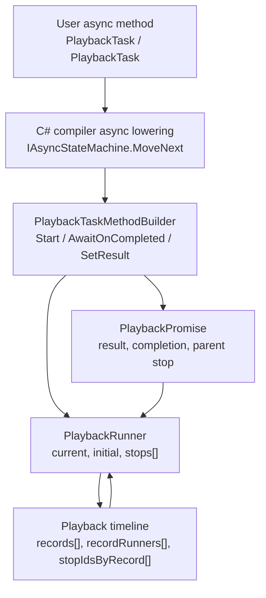
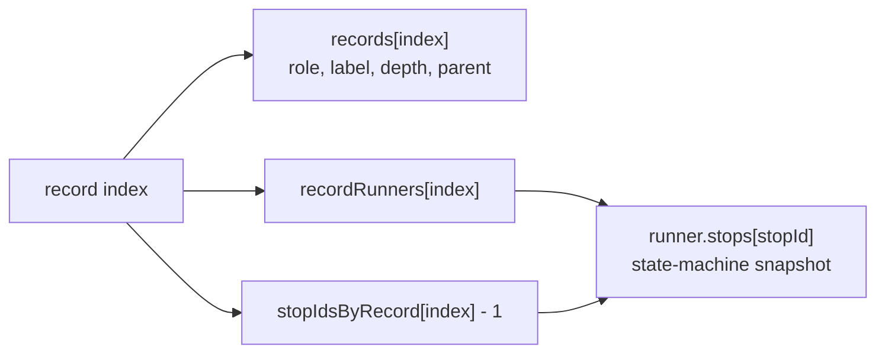
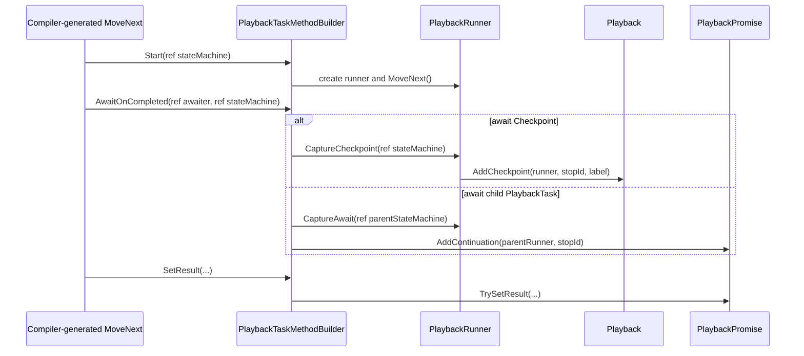
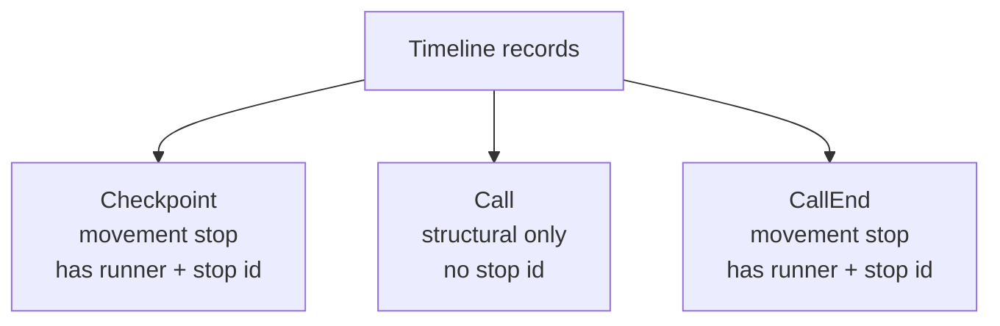
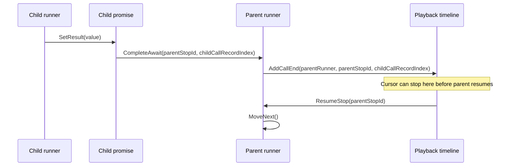
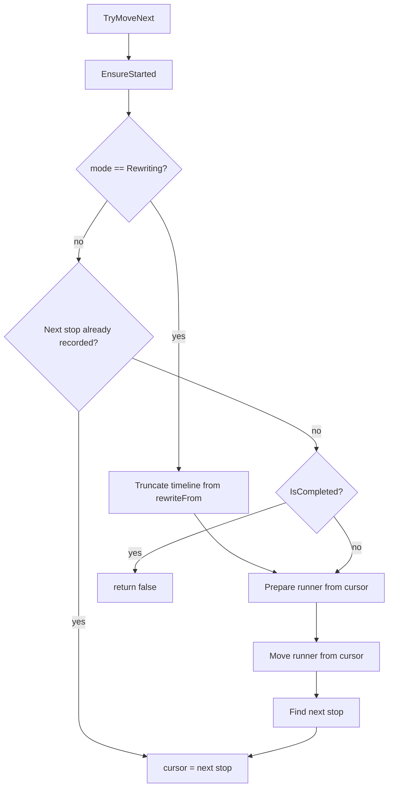
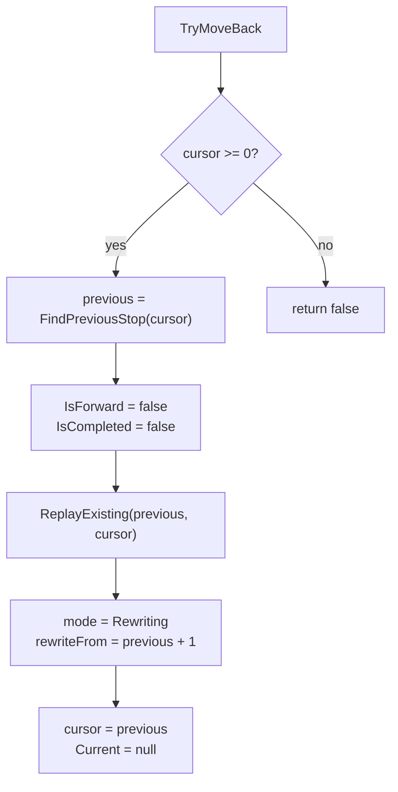
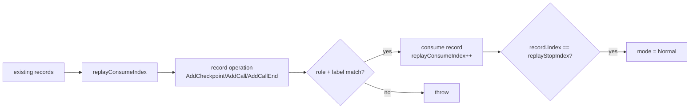
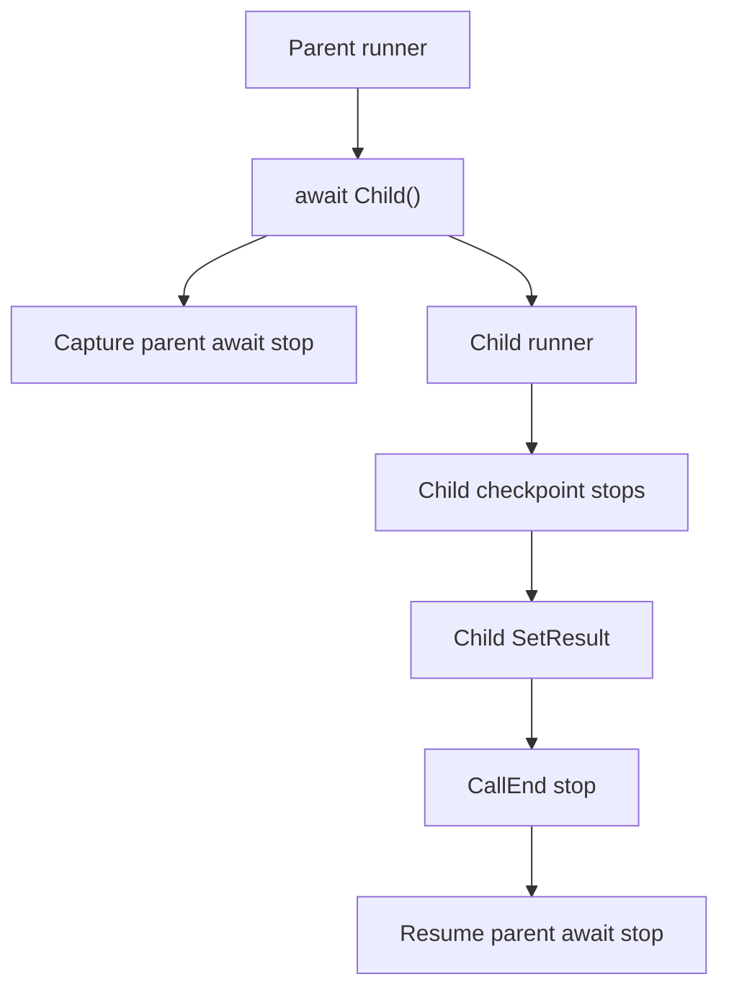

# MinimumPlayback Internal Algorithm

This document explains the internal model used by `src/MinimumPlayback`.
It is intentionally not an API guide.  The goal is to describe how the
implementation uses C# async-method lowering as a resumable state-machine
runtime, and how that runtime is recorded into a small playback timeline.

`MinimumPlayback` is an experiment.  It keeps only the pieces needed to study
checkpoint restore, nested async calls, typed return values, call-end stops, and
backward movement.  It has no virtual time, no scheduler, no `ValueTask`, no
general-purpose `Task` semantics, and no user data store.

## A Small Example

Consider this playback program:

```csharp
using MinimumPlayback;
using static MinimumPlayback.PlaybackTask;

var playback = Playback.Create(_ => Scenario());

Console.WriteLine("-- forward --");
while (playback.TryMoveNext())
    Console.WriteLine("th");

Console.WriteLine("-- back --");
while (playback.TryMoveBack())
    Console.WriteLine("th");

static async PlaybackTask Scenario()
{
    for (var i = 0; i < 5; i++)
    {
        Console.Write(i);
        await Checkpoint(i.ToString());
    }
}
```

The output is:

```text
-- forward --
0th
1th
2th
3th
4th
-- back --
4th
3th
2th
1th
0th
```

This is the behavior the project exists to study.  Backward movement is not C#
running in reverse.  It is forward execution from an earlier state-machine
snapshot.

Forward movement restores the current stop, executes the generated
`MoveNext()` until the next stop, then appends or advances to that stop.
Backward movement restores the previous stop, executes the same generated
`MoveNext()` forward until the current stop is reproduced, consumes that
current stop, and leaves the cursor at the previous stop.

## State Machine Shape

The compiler lowers the loop into one state machine.  The exact generated names
do not matter.  The important part is where `MoveNext()` resumes.

```csharp
private struct ScenarioStateMachine : IAsyncStateMachine
{
    public int state;
    public PlaybackTaskMethodBuilder builder;

    private int i;
    private CheckpointAwaitable.Awaiter checkpointAwaiter;

    private void MoveNext()
    {
        if (state != 0)
            i = 0;
        else
        {
            var awaiter = checkpointAwaiter;
            checkpointAwaiter = default;
            state = -1;
            awaiter.GetResult();
            i++;
        }

        if (i < 5)
        {
            Console.Write(i);
            var awaiter = PlaybackTask.Checkpoint().GetAwaiter();
            if (!awaiter.IsCompleted)
            {
                state = 0;
                checkpointAwaiter = awaiter;
                builder.AwaitUnsafeOnCompleted(ref awaiter, ref this);
                return;
            }
        }

        state = -2;
        builder.SetResult();
    }
}
```

The important fields are:

```text
state              resume point
i                  loop local
checkpointAwaiter  awaiter field used across suspension
builder            custom PlaybackTask builder
```

The generated method has two areas that matter for this example:

```text
Entry area:
  i = 0
  Console.Write(i)
  await Checkpoint()
  capture stop with state=0, i=0

Resume area:
  checkpointAwaiter.GetResult()
  i++
  Console.Write(i)
  await Checkpoint()
  capture stop with state=0, i=current
```

After a full forward run, the stored stops are:

```text
record 0 -> stop0(state=0, i=0)
record 1 -> stop1(state=0, i=1)
record 2 -> stop2(state=0, i=2)
record 3 -> stop3(state=0, i=3)
record 4 -> stop4(state=0, i=4)
```

The write happens before the stop is captured.  Restoring `stop0` and running
`MoveNext()` continues after checkpoint `0`; it prints `1`, not `0`.

## State-Machine Transitions

For this loop, the meaningful state is the pair:

```text
(state, i)
```

`state` is the compiler resume point.  `i` is the user loop local.  The stored
playback stops are snapshots of that pair.

```text
initial = (state=-1, i=undefined)
stop0   = (state=0,  i=0)
stop1   = (state=0,  i=1)
stop2   = (state=0,  i=2)
stop3   = (state=0,  i=3)
stop4   = (state=0,  i=4)
done    = (state=-2, i=5)
```

The generated state-machine transition is always forward:

```text
initial -> stop0
stop0   -> stop1
stop1   -> stop2
stop2   -> stop3
stop3   -> stop4
stop4   -> done
```

Forward and backward movement use the same generated transition arrows:

```text
TryMoveNext from cursor 2:
  restore stop2
  execute stop2 -> stop3
  print 3
  cursor becomes 3

TryMoveBack from cursor 3:
  restore stop2
  execute stop2 -> stop3
  print 3
  consume existing stop3
  cursor becomes 2
```

So both operations execute the same state-machine transition:

```text
stop2(state=0, i=2) -> stop3(state=0, i=3)
```

Direction changes timeline bookkeeping, not the generated `MoveNext()`
direction.



Read each solid arrow as a forward `MoveNext` transition.  Read each dotted
arrow upward as a `MoveBack` operation: it restores the previous stop, executes
the same generated transition forward to reproduce the current stop, consumes
that existing stop, then leaves the cursor at the previous stop.

## Nested Call Example

Now consider a nested typed task:

```csharp
static async PlaybackTask Scenario()
{
    await Checkpoint("start");
    var value = await Fib(2);
    await Checkpoint($"end={value}");
}

static async PlaybackTask<int> Fib(int n)
{
    await Checkpoint($"fib({n})");

    if (n <= 1)
        return n;

    var left = await Fib(n - 1);
    var right = await Fib(n - 2);
    return left + right;
}
```

The important point is that `Fib(2)` is not treated as an opaque normal task.
It becomes a nested playback runner with its own compiler-generated async state
machine.

The resulting timeline is shaped like this:

```text
Checkpoint start
Call In                 // enter Fib(2)
  Checkpoint fib(2)
  Call In               // enter Fib(1)
    Checkpoint fib(1)
  CallEnd Out           // Fib(1) returned
  Call In               // enter Fib(0)
    Checkpoint fib(0)
  CallEnd Out           // Fib(0) returned
CallEnd Out             // Fib(2) returned
Checkpoint end=1
```

Only `Checkpoint` and `CallEnd` are movement stops.  `Call` records are
structural.  They make the debug hierarchy visible, but movement never lands on
them.

Forward movement runs from one stop to the next:

```text
start -> fib(2) -> fib(1) -> CallEnd -> fib(0) -> CallEnd -> CallEnd -> end=1
```

This is the central idea of the whole project:

```text
move back = restore previous stop + replay forward to current stop
```

## High-Level Shape



The compiler-generated state machine is the executable state.  The timeline is
an index over recorded movement/debug records and runner-local stop snapshots.

## Core Idea

C# already compiles an `async` method into a state machine.  That state machine
has a `MoveNext()` method and fields for locals, awaiters, and the current state.

`MinimumPlayback` uses that compiler-generated state machine as the execution
state.  It captures shallow snapshots of state machines at selected boundaries
and stores those snapshots as runner-local stops.

The timeline is not the executable state.  The executable state lives in
`PlaybackRunner<TStateMachine>`:

```text
runner
  current state-machine snapshot
  initial state-machine snapshot
  stop snapshots[]
```

The timeline is an indexed debug and movement log:

```text
record index -> record metadata
record index -> runner
record index -> runner-local stop id
```

Movement restores a runner stop, runs `MoveNext()`, and either records new
records or consumes existing records during replay.



## C# Async Lowering

A method like this:

```csharp
static async PlaybackTask<int> Fib(int n)
{
    await Checkpoint($"fib({n})");
    if (n <= 1)
        return n;

    var left = await Fib(n - 1);
    var right = await Fib(n - 2);
    return left + right;
}
```

is compiled into roughly:

```text
state machine type
  fields:
    builder
    state
    locals
    awaiter fields

  MoveNext()
    run until an incomplete await
    ask builder to register continuation
    return
```

The custom async method builder is selected by:

```csharp
[AsyncMethodBuilder(typeof(PlaybackTaskMethodBuilder))]
public readonly partial struct PlaybackTask
```

and:

```csharp
[AsyncMethodBuilder(typeof(PlaybackTaskMethodBuilder<>))]
public readonly struct PlaybackTask<T>
```

That means the compiler calls `PlaybackTaskMethodBuilder` instead of the normal
`AsyncTaskMethodBuilder`.  The builder receives:

```text
Start(ref stateMachine)
AwaitOnCompleted(ref awaiter, ref stateMachine)
SetResult(...)
SetException(...)
```

Those callbacks are the only place where `MinimumPlayback` integrates with C#
async execution.



## Runtime Scope

`PlaybackRuntime` carries the current playback and current runner through
synchronous execution:

```text
PlaybackRuntime.CurrentPlayback
PlaybackRuntime.CurrentRunner
```

When a runner calls `MoveNext()`, it pushes itself into this ambient scope.
This is how `PlaybackTaskMethodBuilder.Create()` knows which `Playback` owns the
new async method, and how a nested async call knows its parent runner.

This works because the minimal model runs synchronously on one thread.  It is
not a general async scheduler.

## Objects

### Playback

`Playback` owns the timeline and movement cursor:

```csharp
private PlaybackRecord[] records;
private IPlaybackRunner?[] recordRunners;
private int[] stopIdsByRecord;
private int recordCount;
private int cursor;
```

`records` stores the visible timeline.  `recordRunners` maps a record index to
the runner that can resume from that record.  `stopIdsByRecord` maps a record
index to a runner-local stop id, stored as `stopId + 1` so zero means missing.

`Playback` also owns movement mode:

```csharp
private PlaybackMode mode;
private int rewriteFrom;
private int replayConsumeIndex;
private int replayStopIndex;
```

The modes are:

```text
Normal     normal forward movement or recording
Rewriting  next forward move truncates and rebuilds after a back step
Replaying  existing records are consumed, not appended
```

### PlaybackRunner<TStateMachine>

Each async method invocation gets a runner:

```csharp
internal sealed class PlaybackRunner<TStateMachine>
    where TStateMachine : IAsyncStateMachine
```

The runner owns the compiler-generated state machine snapshots:

```csharp
private TStateMachine initial;
private TStateMachine current;
private TStateMachine[] stops;
private int stopCount;
```

The same `stops` array stores both checkpoint snapshots and parent-await
continuation snapshots.  This is possible because call-end stops are always
movement boundaries in the minimal model.

### PlaybackPromise

`PlaybackPromise` is not a general `Task`.  It supports one logical awaiter:

```text
one child playback task -> one parent await site
```

It stores:

```csharp
private IPlaybackRunner? continuationRunner;
private int continuationId;
private Exception? exception;
private bool completed;
```

For `PlaybackTask<T>`, `PlaybackPromise<T>` also stores the result value.

The promise completion path does not invoke an arbitrary `Action`.  It resumes a
runner stop:

```text
promise complete -> continuationRunner.CompleteAwait(continuationId, childCallRecordIndex)
```

This is important for replay.  A normal `Action` would capture the runner's
mutable current state accidentally.  A stop id points to an explicit state
snapshot.

## Timeline Records

The minimal timeline record is:

```csharp
public readonly record struct PlaybackRecord(
    int Index,
    PlaybackRecordRole Role,
    string Label,
    int Depth,
    int ParentIndex
);
```

Roles:

```text
Checkpoint  explicit user checkpoint; movement stop
Call        structural call entry; debug hierarchy only
CallEnd     child completion boundary; movement stop
```

Only `Checkpoint` and `CallEnd` are stops.  `Call` is structural and is not a
movement target.



The parent rules are:

```text
Call parent       = containing call record
Checkpoint parent = current call record
CallEnd parent    = completed child call record
```

This keeps call hierarchy separate from movement cursor state.  A call should
not be parented to the previous checkpoint just because that checkpoint was the
last movement boundary.

## Stop Storage

Runner stops are state-machine snapshots.  A timeline stop record points to a
runner stop id:

```text
record index
  -> records[index]
  -> recordRunners[index]
  -> stopIdsByRecord[index] - 1
```

For a checkpoint:

```text
CaptureCheckpoint(ref stateMachine)
  snapshot state machine
  runner.AddStop(snapshot) -> stop id
  playback.AddCheckpoint(runner, stop id, label) -> record index
```

For an await:

```text
CaptureAwait(ref parentStateMachine)
  snapshot parent await state
  runner.AddStop(snapshot) -> stop id
  childPromise.AddContinuation(parentRunner, stop id)
```

For child completion:

```text
child Promise completes
  parentRunner.CompleteAwait(stop id, child call record index)
  playback.AddCallEnd(parentRunner, stop id, child call record index)
```

For continuing after a call end:

```text
record is CallEnd
  runner = recordRunners[record.Index]
  stopId = stopIdsByRecord[record.Index] - 1
  runner.ResumeStop(stopId)
```

For restoring a checkpoint:

```text
record is Checkpoint
  runner = recordRunners[record.Index]
  stopId = stopIdsByRecord[record.Index] - 1
  runner.RestoreStop(stopId, record.Index)
```

The difference is that a checkpoint restore sets `CurrentRecordIndex`, while a
call-end resume continues the parent from an await snapshot.



## Forward Movement

`TryMoveNext()` is lazy.  `Playback.Create(...)` does not execute user code.
The first move starts the root async method.

The forward algorithm is:

```text
TryMoveNext
  IsForward = true
  EnsureStarted()

  if mode == Rewriting:
      truncate from rewriteFrom
      restore/resume from cursor
      run until next stop is recorded
      move cursor to that stop
      return

  next = FindNextStop(cursor)
  if next exists:
      cursor = next
      return true

  if playback is completed:
      return false

  restore/resume from cursor
  run until new stop is recorded
  cursor = next stop
```

There are two important cases for `restore/resume from cursor`:

```text
cursor == -1
  restore root initial state
  root.MoveNext()

cursor is Checkpoint
  restore runner stop snapshot
  runner.MoveNext()

cursor is CallEnd
  reset runner promise for replay
  runner.ResumeStop(stop id)
```

When user code records a checkpoint or call-end, it appends a new stop record in
normal mode.



## Backward Movement

The runtime does not execute C# backward.  Backward movement means:

```text
restore the previous stop
run forward to the current stop
then move the cursor backward
```

For example, with:

```csharp
for (var i = 0; i < 5; i++)
{
    Console.Write(IsForward ? $"F{i}" : $"B{i}");
    await Checkpoint();
}
```

forward movement prints:

```text
F0 F1 F2 F3 F4
```

backward movement prints:

```text
B4 B3 B2 B1 B0
```

Each backward step replays the segment ending at the current stop while
`IsForward == false`.

The algorithm is:

```text
TryMoveBack
  EnsureStarted()
  if cursor < 0:
      return false

  target = cursor
  previous = FindPreviousStop(cursor)
  IsForward = false
  IsCompleted = false

  ReplayExisting(previous, target)

  mode = Rewriting
  rewriteFrom = previous + 1
  cursor = previous
  Current = null
```

`ReplayExisting(previous, target)` does not append records.  It consumes the
existing timeline records from `previous + 1` through `target`.

If replay does not consume exactly to `target`, the timeline and state-machine
replay have diverged and the runtime throws.



## Existing-Record Replay

During `PlaybackMode.Replaying`, `AddCheckpoint`, `AddCall`, and `AddCallEnd`
do not append records.  They consume the next existing record:

```text
expected index = replayConsumeIndex
expected role  = role being recorded
expected label = label being recorded
```

If role or label differs, the replayed control flow no longer matches the
existing timeline.  The minimal runtime treats that as an error.

When the consumed record reaches `replayStopIndex`, replay mode ends:

```text
mode = Normal
replayConsumeIndex = -1
replayStopIndex = -1
```

This makes backward movement deterministic: moving back from a stop proves that
the segment can be replayed forward to that same stop.



## Rewrite After Back

After a backward step, the cursor points to the previous stop, but the timeline
still contains records after that point.  The next forward move enters
`Rewriting` mode:

```text
rewriteFrom = previous + 1
mode = Rewriting
```

Before recording anything new, the timeline is truncated from `rewriteFrom`:

```text
Array.Clear(records, rewriteFrom, recordCount - rewriteFrom)
Array.Clear(recordRunners, rewriteFrom, ...)
Array.Clear(stopIdsByRecord, rewriteFrom, ...)
recordCount = rewriteFrom
mode = Normal
```

Then the runner is restored or resumed from the cursor and runs forward,
recording new records.  This is how the minimal runtime models changing future
execution after moving back.

## Nested Calls

Every nested `async PlaybackTask` call creates a child runner.

On child runner creation:

```text
parent = PlaybackRuntime.CurrentRunner
child.Depth = parent.Depth + 1
child.CallRecordIndex = playback.AddCall(parent, "In")
parent.AddChild(child)
```

The call record is structural.  It gives the timeline a hierarchy, but it is not
a stop.

When the child finishes, its promise completes.  Since call-end is forced in the
minimal model, completion records a `CallEnd` stop instead of immediately
resuming the parent.  The next movement step from that `CallEnd` resumes the
parent await continuation.

This makes backward movement around nested calls well-defined:

```text
Call
  Checkpoint inside child
CallEnd
parent continuation checkpoint
```

Without `CallEnd`, a child completion and parent continuation can collapse into
one movement step.  That makes move-back ambiguous around await boundaries.



## Typed Return Values

`PlaybackTask<T>` uses `PlaybackPromise<T>`:

```csharp
private T? result;
```

`SetResult(T result)` completes the typed promise.  The parent continuation later
calls the awaiter `GetResult()` and receives the stored result.

The result belongs to the promise, not the awaiter or task struct.  This matters
because task structs are lightweight handles, while the promise is the stable
object shared between child completion and parent await continuation.

During replay, the promise is reset:

```text
completed = false
exception = null
```

The continuation link is preserved.  The same child completion can therefore
resume the same parent await stop again during replay.

## Debug State-Machine Cloning

In Release builds, compiler-generated async state machines are commonly value
types.  Assignment copies the state machine.

In Debug builds, state machines can be reference types.  A normal assignment
would only copy the reference, so restoring a previous checkpoint would see
mutated state.

`MinimumPlayback` uses a shallow clone helper for reference-type state machines:

```csharp
private static TStateMachine SnapshotStateMachine(TStateMachine source)
{
    if (typeof(TStateMachine).IsValueType)
        return source;

    if (source == null)
        throw new InvalidOperationException("State machine is null.");

    return CloneUtility.Clone(source);
}
```

The clone is intentionally shallow.  It is enough to copy compiler state-machine
fields themselves, but it does not deep-copy arbitrary mutable objects referenced
by locals.

## Invariants

Important invariants:

```text
Every Checkpoint record has:
  recordRunners[index] != null
  stopIdsByRecord[index] != 0

Every CallEnd record has:
  recordRunners[index] != null
  stopIdsByRecord[index] != 0

Call records are structural:
  they do not require a stop id
  they are not movement targets

During Replaying:
  each recorded operation must consume the next existing record
  role and label must match
  replay must end exactly at replayStopIndex

During Rewriting:
  records after rewriteFrom are truncated before new records are appended

PlaybackPromise:
  supports one logical awaiter
  stores a parent runner plus runner-local stop id
```

## Why There Is No General Task Semantics

`PlaybackTask` is not `Task`.

The runtime assumes:

```text
one child async method
one parent await site
one continuation stop
```

Multiple independent awaiters would imply one child completion resumes multiple
parents.  That does not fit the timeline tree.  The awaiter `OnCompleted(Action)`
methods exist only because the compiler-required awaiter shape includes them;
they throw for arbitrary use.  The supported path is through
`PlaybackTaskMethodBuilder`.

## Current Limitations

This is a deliberately small model.

Known limitations:

```text
no thread safety
no external scheduler
no ValueTask
no deep clone of mutable referenced locals
no branch mismatch recovery during replay
no public extensibility model
linear scan to find next/previous stop
```

The linear scan is over timeline records.  Since non-stop records are structural
call records, the practical cost is usually the number of structural records
between stops, not the whole timeline size.  A stop index can be added later if
structural density becomes a real problem.

## Mental Model

The minimal runtime can be summarized as:

```text
C# async method
  -> compiler state machine
  -> PlaybackRunner owns state-machine snapshots
  -> Playback records visible timeline events
  -> stop records map to runner-local snapshots
  -> forward movement restores/resumes and runs MoveNext
  -> backward movement restores previous stop and replays forward to current stop
  -> call-end stops make nested await completion explicit
```

The timeline is not the source of truth for execution state.  It is an index
over state-machine snapshots owned by runners.
