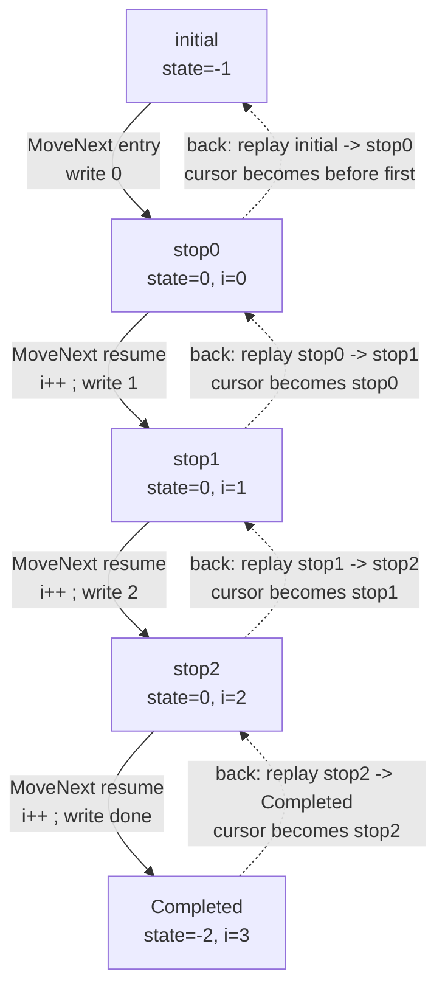
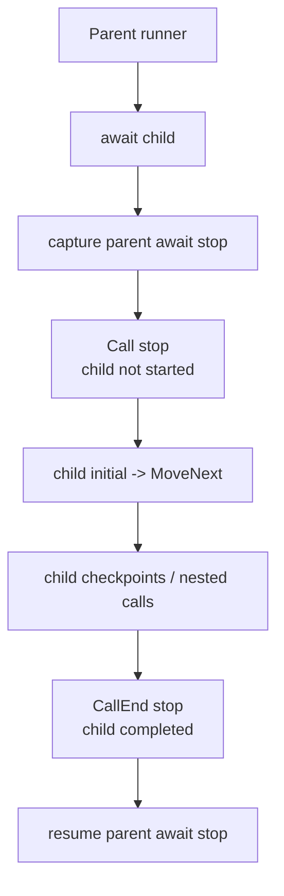

# MinimumPlayback Internal Algorithm

This document explains how `src/MinimumPlayback` works internally. 
The goal is to describe the algorithm: how C# async state machines
are captured, recorded as movement boundaries, moved forward, and replayed to
move backward.

`MinimumPlayback` is a small experimental runtime for checkpoints, nested
`PlaybackTask` calls, typed return values, call-entry and call-exit boundaries,
root completion, and backward movement. It does not model virtual time,
scheduling, `ValueTask`, general `Task` semantics, or user data storage.

## 1. Example

Consider this program:

```csharp
using MinimumPlayback;
using static MinimumPlayback.PlaybackTask;

var playback = Playback.Create(ForScenario);

Console.WriteLine("-- forward --");
while (playback.TryMoveNext())
{
    Console.WriteLine();
}

Console.WriteLine("-- back --");
while (playback.TryMoveBack())
{
    Console.WriteLine();
}

Console.WriteLine("-- forward --");
while (playback.TryMoveNext())
{
    Console.WriteLine();
}

static async PlaybackTask ForScenario(Playback playback)
{
    for (var i = 0; i < 3; i++)
    {
        Console.Write(i);
        await Checkpoint();
    }

    Console.Write("done");
}
```

Output:

```text
-- forward --
0
1
2
done
-- back --
done
2
1
0
-- forward --
0
1
2
done
```

## 2. Core Model

C# async methods are commonly lowered into compiler-generated
`IAsyncStateMachine` implementations. That generated state machine owns the
resume state, locals, awaiter fields, and a `MoveNext()` method.

.NET 11 introduces Runtime Async, where an async method does not necessarily go
through this compiler-generated `IAsyncStateMachine` shape. `MinimumPlayback`
relies on the custom async method builder and state-machine lowering path, so
this document describes that path.

`MinimumPlayback` uses the generated state machine as executable state. It does
not interpret user code. It stores snapshots of the state machine at known
movement boundaries and records those boundaries in the timeline.

The sample `ForScenario` is lowered into one generated state machine. Exact
names differ by compiler; simplified generated code looks like this:

```csharp
[StructLayout(LayoutKind.Auto)]
[CompilerGenerated]
private struct ForScenarioStateMachine : IAsyncStateMachine
{
    public int state;
    public PlaybackTaskMethodBuilder builder;

    private int i;
    private CheckpointAwaitable.Awaiter checkpointAwaiter;

    private void MoveNext()
    {
        var num = state;

        try
        {
            if (num != 0)
            {
                i = 0;
                goto LoopTest;
            }

            var awaiter = checkpointAwaiter;
            checkpointAwaiter = default;
            num = state = -1;

        ResumeAfterCheckpoint:
            awaiter.GetResult();
            i++;

        LoopTest:
            if (i < 3)
            {
                Console.Write(i);
                awaiter = PlaybackTask.Checkpoint().GetAwaiter();
                if (!awaiter.IsCompleted)
                {
                    num = state = 0;
                    checkpointAwaiter = awaiter;
                    builder.AwaitUnsafeOnCompleted(ref awaiter, ref this);
                    return;
                }

                goto ResumeAfterCheckpoint;
            }

            Console.Write("done");
        }
        catch (Exception exception)
        {
            state = -2;
            builder.SetException(exception);
            return;
        }

        state = -2;
        builder.SetResult();
    }

    void IAsyncStateMachine.MoveNext() => MoveNext();

    void IAsyncStateMachine.SetStateMachine(IAsyncStateMachine stateMachine)
    {
        builder.SetStateMachine(stateMachine);
    }
}
```

The generated state machine keeps these fields across calls to `MoveNext()`:

| Field | Meaning |
| --- | --- |
| `state` | Compiler resume point. |
| `i` | User loop local. |
| `checkpointAwaiter` | Awaiter contract for the suspended operation. `GetResult()` is the resume point after `await`: it propagates exceptions and returns the awaited value. `Checkpoint()` returns void, but typed child awaits use the same pattern to return `T`. |
| `builder` | Custom builder that lets `MinimumPlayback` capture and resume execution. |

Playback does not record side effects such as console output. It records
boundaries where the generated state machine can be restored and resumed. For
the example above, the timeline records are:

| Timeline record | Recorded when |
| --- | --- |
| First checkpoint | `await Checkpoint()` suspends with `i == 0`. |
| Second checkpoint | `await Checkpoint()` suspends with `i == 1`. |
| Third checkpoint | `await Checkpoint()` suspends with `i == 2`. |
| `Completed` | The root state machine calls `SetResult()`. |

This ordered record list is called the timeline in this document.

For this example, each stop corresponds mainly to the pair `(state, i)`:

| Boundary | `state` | `i` |
| --- | ---: | --- |
| `initial` | `-1` | undefined |
| `stop0` | `0` | `0` |
| `stop1` | `0` | `1` |
| `stop2` | `0` | `2` |
| `Completed` | `-2` | `3` |

Forward and backward movement differ in which timeline record is selected as
the cursor. Generated `MoveNext()` still executes forward.



Timeline vocabulary:

| Term | Meaning |
| --- | --- |
| Timeline | Ordered `PlaybackRecord[]` built by executing user code. |
| Record | One movement boundary in that ordered array. |
| Boundary | A place where `TryMoveNext()` or `TryMoveBack()` can stop. |
| Cursor | Current record index in the timeline, or `-1` before the first record. |
| Future | Records after the cursor; they may be truncated after moving backward. |

The main runtime objects are:

| Object | Owns |
| --- | --- |
| `Playback` | Timeline records, record-to-runner map, record-to-stop-id map, movement cursor, replay/rewrite mode. |
| `PlaybackRunner<TStateMachine>` | Initial state-machine snapshot, current executable snapshot, and `stops[]` snapshots captured at checkpoints and parent await sites. |
| `PlaybackPromise` | Child completion state, parent continuation runner, and parent continuation stop id. |

During movement, the cursor is just a record index. Playback uses that index to
find the state-machine snapshot needed to run the next forward segment:

| Current record role | Restore source |
| --- | --- |
| Before first record (`-1`) | Root runner initial snapshot. |
| `Checkpoint` | Owning runner and `runner.stops[stopId]`. |
| `Call` | Child runner initial snapshot. |
| `CallEnd` | Parent runner and `runner.stops[stopId]`. |
| `Completed` | No restore source; the root method already ended. |

The record stores role, label, depth, and parent index. Runner and stop id are
kept beside the record index as restore/replay data.

## 3. Nested Call and the Call Boundary

A nested `PlaybackTask` introduces `Call` and `CallEnd` records:

```csharp
var playback = Playback.Create(_ => Nest(3, 3));

static async PlaybackTask Nest(int m, int n)
{
    Console.WriteLine($"[{m - n}]Entering nest({n})" + (IsForward ? " ↓" : " ↑"));
    if (n <= 0)
    {
        return;
    }

    await Nest(m, n - 1);

    Console.WriteLine($"[{m + n}]Exiting nest({n})" + (IsForward ? " ↓" : " ↑"));
}
```

Forward output:

```text
[0]Entering nest(3) ↓
[1]Entering nest(2) ↓
[2]Entering nest(1) ↓
[3]Entering nest(0) ↓
[4]Exiting nest(1) ↓
[5]Exiting nest(2) ↓
[6]Exiting nest(3) ↓
```

Backward output from completion:

```text
[6]Exiting nest(3) ↑
[5]Exiting nest(2) ↑
[4]Exiting nest(1) ↑
[3]Entering nest(0) ↑
[2]Entering nest(1) ↑
[1]Entering nest(2) ↑
[0]Entering nest(3) ↑
```

This dump helper prints the resulting timeline:

```csharp
static void DumpRecord(PlaybackRecord record)
{
    Console.WriteLine(
        $"{record.Index, 3}: {string.Concat(Enumerable.Repeat("| ", record.Depth))}{record.Label} depth={record.Depth} parent={record.ParentIndex}"
    );
}

static void Dump(Playback playback)
{
    for (var i = 0; i < playback.Records.Length; i++)
    {
        DumpRecord(playback.Records[i]);
    }
}
```

Timeline:

```text
  0: In depth=0 parent=-1
  1: | In depth=1 parent=0
  2: | | In depth=2 parent=1
  3: | | Out depth=2 parent=2
  4: | Out depth=1 parent=1
  5: Out depth=0 parent=0
  6: Completed depth=0 parent=-1
```

The `Call` record lets movement stop before a child state machine starts. Moving
forward from `Call` restores the child runner's `initial` state and calls
`MoveNext()`. The `CallEnd` record lets movement stop after the child has
completed but before the parent await continuation resumes.



## 4. Compiler Callbacks to Playback Runtime

`PlaybackTask` and `PlaybackTask<T>` use custom async method builders:

```csharp
[AsyncMethodBuilder(typeof(PlaybackTaskMethodBuilder))]
public readonly partial struct PlaybackTask;

[AsyncMethodBuilder(typeof(PlaybackTaskMethodBuilder<>))]
public readonly struct PlaybackTask<T>;
```

The compiler-generated state machine calls the custom builder instead of
`AsyncTaskMethodBuilder`. Those calls enter `PlaybackTaskMethodBuilderCore` and
connect generated `MoveNext()` execution to playback runtime state:

| Generated state-machine event | Builder/runtime path | Playback effect |
| --- | --- | --- |
| Async method starts. | Builder `Start(ref stateMachine)`. | Create a runner and store the initial state-machine snapshot. |
| `await` cannot complete synchronously. | `AwaitUnsafeOnCompleted(...)` -> `CaptureAwait(...)`. | Store a stop snapshot and usually record a timeline boundary. |
| Method returns normally. | `SetResult(...)` -> runner completion. | Record `Completed` for root, or `CallEnd` for child. |
| Method throws. | `SetException(...)` -> runner completion with exception. | Same timeline path as completion; exception is stored in the promise. |

### Async Method Start

When a generated async method starts, the builder creates the runner that owns
that method's state-machine snapshots.

| Step | Operation | Purpose |
| ---: | --- | --- |
| 1 | Read `PlaybackRuntime.CurrentRunner`. | Find the parent runner, or `null` for the root. |
| 2 | Create `PlaybackRunner<TStateMachine>`. | Bind the generated state machine to playback execution. |
| 3 | Attach the runner to the method promise. | Let awaiters and typed results find the same completion object. |
| 4 | Store the initial state-machine snapshot. | Preserve the entry state used by root start and `Call` replay. |

Root and nested methods then diverge:

| Case | Operation | Effect |
| --- | --- | --- |
| Root method | Attach as root runner and call `MoveNext()` immediately. | The first `TryMoveNext()` runs user code until the first boundary. |
| Nested `PlaybackTask` | Record `Call` with the child runner. | Movement stops before the child starts; the child runs only when playback advances from `Call`. |

### Await Suspension

When generated `MoveNext()` reaches an incomplete await, it calls:

```csharp
builder.AwaitUnsafeOnCompleted(ref awaiter, ref this);
```

`MinimumPlayback` uses that callback as the capture point for replayable state:

| Awaiter case | Captured state | Timeline effect |
| --- | --- | --- |
| Replay suspension | Current state machine and replay owner record index. | Re-enter replay without appending a new record. |
| Checkpoint label | Current state machine into `runner.stops[]`. | Record or consume `Checkpoint`. |
| Child promise | Parent await-site state machine into `runner.stops[]`. | Register parent continuation on the child promise. |

Checkpoint capture creates a visible stop for user movement. Child-await capture
creates the parent continuation stop that will later be used by `CallEnd`.

### Method Completion

When generated `MoveNext()` finishes, it calls `builder.SetResult()`. If user
code throws, the catch block calls `builder.SetException(exception)`.

Both paths complete the runner's promise. For the root runner, completion
records `Completed`. For a child runner, promise completion records `CallEnd`
through the registered parent continuation:

| Runner | Completion path | Timeline effect |
| --- | --- | --- |
| Root | `MarkCompleted()`. | Record or consume `Completed`. |
| Child | Complete promise, then resume registered parent continuation through `CompleteAwait(...)`. | Record or consume `CallEnd`. |

`PlaybackRuntime` provides the ambient synchronous scope:

| Slot | Meaning |
| --- | --- |
| `CurrentPlayback` | Playback instance currently executing generated `MoveNext()`. |
| `CurrentRunner` | Runner currently executing generated `MoveNext()`. |

When a runner calls `MoveNext()`, it pushes itself as `CurrentRunner`. This is
how a nested async method discovers its parent runner.

## 5. Timeline Records and Stop Storage

Timeline records are produced by the callback flow above:

| Record role | Produced from | Stop position |
| --- | --- | --- |
| `Checkpoint` | `AwaitUnsafeOnCompleted(...)` for `await Checkpoint()`. | After the checkpoint await suspends. |
| `Call` | Builder start of a nested `PlaybackTask`. | Before the child state machine begins. |
| `CallEnd` | Child `SetResult(...)` or `SetException(...)`. | After child completion, before parent continuation resumes. |
| `Completed` | Root `SetResult(...)` or `SetException(...)`. | After root completion. |

The stored record is small:

```csharp
public readonly record struct PlaybackRecord(
    int Index,
    PlaybackRecordRole Role,
    string Label,
    int Depth,
    int ParentIndex
);
```

Roles:

| Role | Meaning | Runtime state |
| --- | --- | --- |
| `Checkpoint` | Explicit user checkpoint. | Runner + stop id. |
| `Call` | Child entry boundary. | Child runner initial state. |
| `CallEnd` | Child completion boundary. | Parent runner + stop id. |
| `Completed` | Root completion boundary. | No runner state. |

All four roles are movement boundaries.

Storage rules:

| Role | `recordRunners[index]` | `stopIdsByRecord[index]` |
| --- | --- | --- |
| `Checkpoint` | Owning runner. | Runner-local stop id. |
| `Call` | Child runner. | `-1`. |
| `CallEnd` | Parent runner. | Parent await stop id. |
| `Completed` | `null`. | `-1`. |

`stopIdsByRecord` stores the real stop id. Missing stop ids are `-1`, defined in
code as `NoStopId`. The `-1` sentinel is maintained where the array is resized
or truncated, so restore/resume code can use `stopIdsByRecord[index]` directly.

Parent/depth rules:

| Role | `ParentIndex` |
| --- | --- |
| `Call` | Containing call record, or `-1` at root. |
| `Checkpoint` | Current call record, or `-1` at root. |
| `CallEnd` | Completed child call record. |
| `Completed` | `-1`. |

## 6. Moving Forward

`Playback.Create(...)` stores the entry delegate. The root state machine starts
on the first `TryMoveNext()`.

Forward movement restores or resumes from the current cursor and runs generated
`MoveNext()` until the next timeline record is appended. The cursor then moves
to that new record.

After a backward step, the next forward movement first truncates the old future
from `rewriteFrom`, then records a new future.

## 7. Moving Back

Backward movement replays the previous forward segment with `IsForward == false`.
C# still executes through generated `MoveNext()`.

| Phase | Runtime behavior |
| --- | --- |
| Select segment. | Use the current cursor as `target` and find the previous timeline record. |
| Restore. | Restore the snapshot for the previous record. |
| Replay. | Run `MoveNext()` forward until the target record is reproduced. |
| Move cursor. | Consume the reproduced target and move the cursor to the previous record. |
| Prepare rewrite. | Mark records after the new cursor as future records to truncate on the next forward move. |

During replay, each attempted record append must match the next existing record.
A role or label mismatch means the state-machine execution no longer matches the
timeline.

## 8. Typed Results, Exceptions, and Cloning

`PlaybackPromise<T>` carries a child result from child completion to the parent
awaiter.

Before replaying a child completion, the promise resets completion state:

| Promise field | Replay reset |
| --- | --- |
| `completed` | `false` |
| `exception` | `null` |

The continuation runner and stop id remain linked, so replayed child completion
records the same `CallEnd` and resumes the same parent await state.

Exceptions are stored in the promise and thrown from `GetResult()`.

### Debug State-Machine Cloning

In Release builds, compiler-generated async state machines are commonly value
types. Assignment copies the state machine.

In Debug builds, state machines can be reference types. A normal assignment
would only copy the reference, so restoring a previous checkpoint would see
mutated state.

`MinimumPlayback` uses a shallow clone helper for reference-type state machines:

```csharp
private static TStateMachine SnapshotStateMachine(TStateMachine source)
{
    if (typeof(TStateMachine).IsValueType)
        return source;

    if (source == null)
        throw new InvalidOperationException("State machine is null.");

    return CloneUtility.Clone(source);
}
```

The helper routes a reference-type state machine through `MemberwiseClone()`:

```csharp
internal class CloneUtility
{
    public static T Clone<T>(T obj)
    {
        var cloneable = Unsafe.As<T, CloneUtility>(ref obj);
        return (T)cloneable.MemberwiseClone();
    }
}
```

This is a shallow clone. It copies compiler state-machine fields, but it does
not deep-copy arbitrary mutable objects referenced by locals.

## 9. Constraints

| Constraint | Meaning |
| --- | --- |
| Single-threaded runtime | Movement is driven by explicit playback calls. |
| `PlaybackTask` model | The runtime models `PlaybackTask` / `PlaybackTask<T>`, not `ValueTask` or general `Task`. |
| One parent await site per child task | A child promise keeps one parent continuation. |
| Shallow clone for reference-type state machines | Debug reference-type state machines are cloned shallowly. |
| Linear timeline lookup | Next/previous record lookup scans timeline records. |
