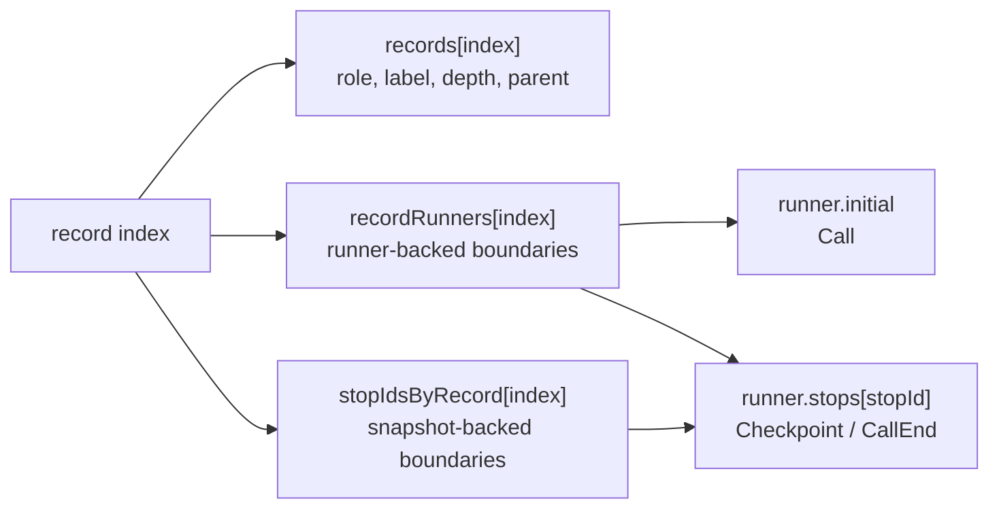
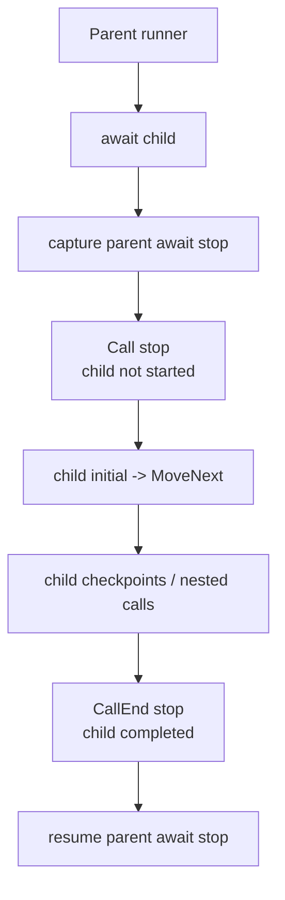
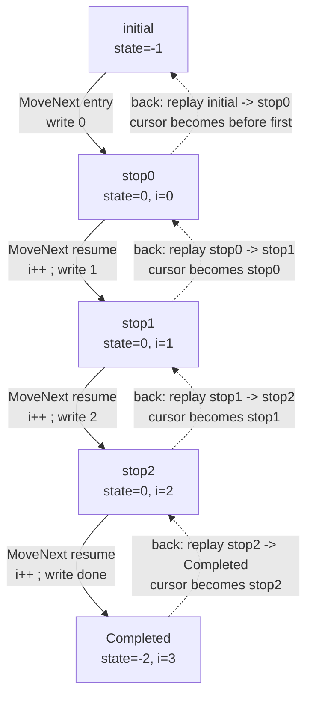

# MinimumPlayback Internal Algorithm

This document explains how `src/MinimumPlayback` works internally. 
The goal is to describe the algorithm: how C# async state machines
are captured, recorded as timeline boundaries, moved forward, and replayed to
move backward.

`MinimumPlayback` is deliberately small. It has checkpoints, nested
`PlaybackTask` calls, typed return values, call-entry and call-exit boundaries,
root completion, and backward movement. It has no virtual time, scheduler,
`ValueTask`, general `Task` semantics, or user data store.

## 1. Observable Behavior

Consider this program:

```csharp
using MinimumPlayback;
using static MinimumPlayback.PlaybackTask;

var playback = Playback.Create(ForScenario);

Console.WriteLine("-- forward --");
while (playback.TryMoveNext())
{
    Console.WriteLine();
}

Console.WriteLine("-- back --");
while (playback.TryMoveBack())
{
    Console.WriteLine();
}

Console.WriteLine("-- forward --");
while (playback.TryMoveNext())
{
    Console.WriteLine();
}

static async PlaybackTask ForScenario(Playback playback)
{
    for (var i = 0; i < 3; i++)
    {
        Console.Write(i);
        await Checkpoint();
    }

    Console.Write("done");
}
```

Output:

```text
-- forward --
0
1
2
done
-- back --
done
2
1
0
-- forward --
0
1
2
done
```

Backward movement is not C# running in reverse. A backward step restores an
earlier state-machine snapshot, runs the generated `MoveNext()` forward until
the current timeline boundary is reproduced, consumes that boundary, and then
moves the cursor backward.

| Movement | What happens |
| --- | --- |
| Forward | Restore the current boundary, run `MoveNext()`, then land on the next boundary. |
| Backward | Restore the previous boundary, run `MoveNext()` forward to reproduce the current boundary, then consume the current boundary. |

## 2. Core Model

C# lowers an `async` method into an `IAsyncStateMachine`. That generated state
machine owns the resume state, locals, awaiter fields, and a `MoveNext()` method.

`MinimumPlayback` uses the generated state machine as executable state. It does
not interpret user code. It stores snapshots of the state machine at known
movement boundaries.

The main runtime objects are:

| Object | Owns |
| --- | --- |
| `Playback` | Timeline records, record-to-runner map, record-to-stop-id map, movement cursor, replay/rewrite mode. |
| `PlaybackRunner<TStateMachine>` | Initial state-machine snapshot, current executable snapshot, and `stops[]` snapshots captured at checkpoints and parent await sites. |
| `PlaybackPromise` | Child completion state, parent continuation runner, and parent continuation stop id. |

The timeline is not executable state. It is an index over visible movement
boundaries:

| Lookup | Meaning |
| --- | --- |
| `record index -> PlaybackRecord` | Metadata for the visible timeline record. |
| `record index -> runner` | Runner for runner-backed boundaries such as `Call`, `Checkpoint`, and `CallEnd`. |
| `record index -> stop id` | Runner-local snapshot id for snapshot-backed boundaries such as `Checkpoint` and `CallEnd`. |



`Call` is runner-backed but not stop-id-backed: it starts the child runner from
that runner's `initial` snapshot. `Checkpoint` and `CallEnd` are backed by a
runner plus a runner-local stop id. `Completed` is a boundary with no runner
state.

## 3. Nested Call and the Call Boundary

`Call` is easiest to understand from a nested example:

```csharp
var playback = Playback.Create(_ => Nest(3, 3));

static async PlaybackTask Nest(int m, int n)
{
    Console.WriteLine($"Entering nest({n})" + (IsForward ? " forward" : " backward"));

    if (n <= 0)
        return;

    for (var i = n; i < m; i++)
    {
        await Checkpoint();
        Console.WriteLine($"In nest({n}) loop {i}" + (IsForward ? " forward" : " backward"));
    }

    await Nest(m, n - 1);

    Console.WriteLine($"Exiting nest({n})" + (IsForward ? " forward" : " backward"));
}
```

Forward output:

```text
Entering nest(3) forward
Entering nest(2) forward
In nest(2) loop 2 forward
Entering nest(1) forward
In nest(1) loop 1 forward
In nest(1) loop 2 forward
Entering nest(0) forward
Exiting nest(1) forward
Exiting nest(2) forward
Exiting nest(3) forward
```

Backward output from completion:

```text
Exiting nest(3) backward
Exiting nest(2) backward
Exiting nest(1) backward
Entering nest(0) backward
In nest(1) loop 2 backward
In nest(1) loop 1 backward
Entering nest(1) backward
In nest(2) loop 2 backward
Entering nest(2) backward
Entering nest(3) backward
```

This dump helper prints the resulting timeline:

```csharp
static void DumpRecord(PlaybackRecord record)
{
    Console.WriteLine(
        $"{record.Index, 3}: {string.Concat(Enumerable.Repeat("| ", record.Depth))}{record.Label} depth={record.Depth} parent={record.ParentIndex}"
    );
}

static void Dump(Playback playback)
{
    for (var i = 0; i < playback.Records.Length; i++)
    {
        DumpRecord(playback.Records[i]);
    }
}
```

Timeline:

```text
  0: In depth=0 parent=-1
  1: | Checkpoint depth=1 parent=0
  2: | In depth=1 parent=0
  3: | | Checkpoint depth=2 parent=2
  4: | | Checkpoint depth=2 parent=2
  5: | | In depth=2 parent=2
  6: | | Out depth=2 parent=5
  7: | Out depth=1 parent=2
  8: Out depth=0 parent=0
  9: Completed depth=0 parent=-1
```

The `Call` record lets movement stop before a child state machine starts. Moving
forward from `Call` restores the child runner's `initial` state and calls
`MoveNext()`. The `CallEnd` record lets movement stop after the child has
completed but before the parent await continuation resumes.



## 4. Generated State Machine Example

The sample `ForScenario` is lowered into one generated state machine. Exact
names differ by compiler, but the shape is what matters:

```csharp
[StructLayout(LayoutKind.Auto)]
[CompilerGenerated]
private struct ForScenarioStateMachine : IAsyncStateMachine
{
    public int state;
    public PlaybackTaskMethodBuilder builder;

    private int i;
    private CheckpointAwaitable.Awaiter checkpointAwaiter;

    private void MoveNext()
    {
        var num = state;

        try
        {
            if (num != 0)
            {
                i = 0;
                goto LoopTest;
            }

            var awaiter = checkpointAwaiter;
            checkpointAwaiter = default;
            num = state = -1;

        ResumeAfterCheckpoint:
            awaiter.GetResult();
            i++;

        LoopTest:
            if (i < 3)
            {
                Console.Write(i);
                awaiter = PlaybackTask.Checkpoint().GetAwaiter();
                if (!awaiter.IsCompleted)
                {
                    num = state = 0;
                    checkpointAwaiter = awaiter;
                    builder.AwaitUnsafeOnCompleted(ref awaiter, ref this);
                    return;
                }

                goto ResumeAfterCheckpoint;
            }

            Console.Write("done");
        }
        catch (Exception exception)
        {
            state = -2;
            builder.SetException(exception);
            return;
        }

        state = -2;
        builder.SetResult();
    }

    void IAsyncStateMachine.MoveNext() => MoveNext();

    void IAsyncStateMachine.SetStateMachine(IAsyncStateMachine stateMachine)
    {
        builder.SetStateMachine(stateMachine);
    }
}
```

The fields that matter in this example are:

| Field | Meaning |
| --- | --- |
| `state` | Compiler resume point. |
| `i` | User loop local. |
| `checkpointAwaiter` | Awaiter contract for the suspended operation. `GetResult()` is the resume point after `await`: it propagates exceptions and returns the awaited value. `Checkpoint()` returns void, but typed child awaits use the same pattern to return `T`. |
| `builder` | Custom builder that lets `MinimumPlayback` capture and resume execution. |

For this example, the meaningful state is mostly `(state, i)`:

| Boundary | `state` | `i` |
| --- | ---: | --- |
| `initial` | `-1` | undefined |
| `stop0` | `0` | `0` |
| `stop1` | `0` | `1` |
| `stop2` | `0` | `2` |
| `Completed` | `-2` | `3` |

Direction changes timeline bookkeeping, not generated `MoveNext()` execution.



## 5. Builder and Runner Lifecycle

`PlaybackTask` and `PlaybackTask<T>` use custom async method builders:

```csharp
[AsyncMethodBuilder(typeof(PlaybackTaskMethodBuilder))]
public readonly partial struct PlaybackTask;

[AsyncMethodBuilder(typeof(PlaybackTaskMethodBuilder<>))]
public readonly struct PlaybackTask<T>;
```

The compiler-generated state machine calls the custom builder instead of
`AsyncTaskMethodBuilder`. The real dispatch lives in
`PlaybackTaskMethodBuilderCore`.

### Start

`Start(ref stateMachine)` creates the runner for the async method being lowered.

| Step | Operation | Purpose |
| ---: | --- | --- |
| 1 | Read `PlaybackRuntime.CurrentRunner`. | Find the parent runner, or `null` for the root. |
| 2 | Create `PlaybackRunner<TStateMachine>`. | Bind the generated state machine to playback execution. |
| 3 | Attach the runner to the method promise. | Let awaiters and typed results find the same completion object. |
| 4 | Store the initial state-machine snapshot. | Preserve the entry state used by root start and `Call` replay. |

Root and nested methods then diverge:

| Case | Operation | Effect |
| --- | --- | --- |
| Root method | Attach as root runner and call `MoveNext()` immediately. | The first `TryMoveNext()` runs user code until the first boundary. |
| Nested `PlaybackTask` | Record `Call` with the child runner. | Movement stops before the child starts; the child runs only when playback advances from `Call`. |

### CaptureAwait

`CaptureAwait(ref awaiter, ref stateMachine)` handles incomplete awaits:

| Awaiter case | Captured state | Timeline effect |
| --- | --- | --- |
| Replay suspension | Current state machine and replay owner record index. | Re-enter replay without appending a new record. |
| Checkpoint label | Current state machine into `runner.stops[]`. | Record or consume `Checkpoint`. |
| Child promise | Parent await-site state machine into `runner.stops[]`. | Register parent continuation on the child promise. |

Checkpoint capture creates a visible stop for user movement. Child-await capture
creates the parent continuation stop that will later be used by `CallEnd`.

### Complete

`Complete()` and `Complete<T>(...)` mark the runner as completed and complete its
promise.

For the root runner, `MarkCompleted()` records `Completed`. For a child runner,
promise completion records `CallEnd` through the registered parent continuation:

| Runner | Completion path | Timeline effect |
| --- | --- | --- |
| Root | `MarkCompleted()`. | Record or consume `Completed`. |
| Child | Complete promise, then resume registered parent continuation through `CompleteAwait(...)`. | Record or consume `CallEnd`. |

`SetException(...)` follows the same completion path but stores the exception in
the promise.

`PlaybackRuntime` provides the ambient synchronous scope:

| Slot | Meaning |
| --- | --- |
| `CurrentPlayback` | Playback instance currently executing generated `MoveNext()`. |
| `CurrentRunner` | Runner currently executing generated `MoveNext()`. |

When a runner calls `MoveNext()`, it pushes itself as `CurrentRunner`. This is
how a nested async method discovers its parent runner.

## 6. Timeline Records and Stop Storage

Timeline records are small value records:

```csharp
public readonly record struct PlaybackRecord(
    int Index,
    PlaybackRecordRole Role,
    string Label,
    int Depth,
    int ParentIndex
);
```

Roles:

| Role | Meaning | Runtime state |
| --- | --- | --- |
| `Checkpoint` | Explicit user checkpoint. | Runner + stop id. |
| `Call` | Child entry boundary. | Child runner initial state. |
| `CallEnd` | Child completion boundary. | Parent runner + stop id. |
| `Completed` | Root completion boundary. | No runner state. |

All four roles are movement boundaries.

Storage rules:

| Role | `recordRunners[index]` | `stopIdsByRecord[index]` |
| --- | --- | --- |
| `Checkpoint` | Owning runner. | Runner-local stop id. |
| `Call` | Child runner. | `-1`. |
| `CallEnd` | Parent runner. | Parent await stop id. |
| `Completed` | `null`. | `-1`. |

`stopIdsByRecord` stores the real stop id. Missing stop ids are `-1`, defined in
code as `NoStopId`. The `-1` sentinel is maintained where the array is resized
or truncated, so restore/resume code can use `stopIdsByRecord[index]` directly.

Parent/depth rules:

| Role | `ParentIndex` |
| --- | --- |
| `Call` | Containing call record, or `-1` at root. |
| `Checkpoint` | Current call record, or `-1` at root. |
| `CallEnd` | Completed child call record. |
| `Completed` | `-1`. |

## 7. Moving Forward

`Playback.Create(...)` is lazy. It stores the entry delegate but does not run
user code. The first `TryMoveNext()` starts the root runner and runs until the
first boundary is recorded.

If the next stop already exists, moving forward only advances the cursor:

| Step | Operation |
| ---: | --- |
| 1 | Find the next timeline stop after `cursor`. |
| 2 | Set `cursor` to that record index. |
| 3 | Set `Current` to that record. |

If there is no recorded next stop and playback is not completed, the runtime
restores or resumes from the current cursor and executes `MoveNext()` until a
new record is appended.

Cursor preparation:

| Cursor | Preparation |
| --- | --- |
| `-1` | Restore root initial state and run `root.MoveNext()`. |
| `Checkpoint` | Restore `runner.stops[stopId]` and run `runner.MoveNext()`. |
| `Call` | Restore child runner initial state and run `child.MoveNext()`. |
| `CallEnd` | Reset parent promise for replay and resume parent await stop. |
| `Completed` | No forward segment exists. |

If the previous backward move put playback in `Rewriting` mode, the next forward
move first truncates records from `rewriteFrom`, fills cleared stop ids with
`-1`, and then records a new future.

## 8. Moving Back

`TryMoveBack()` never executes C# backward. It replays a forward segment while
`IsForward == false`.

Algorithm:

| Step | Operation |
| ---: | --- |
| 1 | Save the current cursor as `target`. |
| 2 | Find the previous stop before `target`. |
| 3 | Set `IsForward = false` and clear `IsCompleted`. |
| 4 | Replay forward from `previous` through `target`. |
| 5 | Enter `Rewriting` mode from `previous + 1`. |
| 6 | Move `cursor` to `previous` and clear `Current`. |

`ReplayExisting(previous, target)` sets replay mode, restores the runner for
`previous`, runs forward, and consumes existing records from `previous + 1`
through `target`.

During replay, record creation methods consume existing records instead of
appending:

| Method | Replay behavior |
| --- | --- |
| `AddCheckpoint` | Consume the next existing `Checkpoint`. |
| `AddCall` | Consume the next existing `Call`. |
| `AddCallEnd` | Consume the next existing `CallEnd`. |
| `OnRootCompleted` | Consume the existing `Completed` record. |

Role and label must match. If replay does not consume exactly through `target`,
the runtime throws because the state-machine execution no longer matches the
timeline.

After a successful backward step, the cursor points to `previous`, but the old
future still exists in arrays. `Rewriting` mode means the next forward movement
will truncate that future before recording anything new.

## 9. Typed Results, Exceptions, and Cloning

`PlaybackTask<T>` stores its result in `PlaybackPromise<T>`, not in the task
struct. The task struct is only a handle; the promise is the shared object
between child completion and parent continuation.

During replay, a promise resets only completion state:

| Promise field | Replay reset |
| --- | --- |
| `completed` | `false` |
| `exception` | `null` |

The continuation runner and stop id remain linked, so the same replayed child
completion can record the same `CallEnd` and later resume the same parent await
state.

Exceptions are stored in the promise and thrown from `GetResult()`.

### Debug State-Machine Cloning

In Release builds, compiler-generated async state machines are commonly value
types. Assignment copies the state machine.

In Debug builds, state machines can be reference types. A normal assignment
would only copy the reference, so restoring a previous checkpoint would see
mutated state.

`MinimumPlayback` uses a shallow clone helper for reference-type state machines:

```csharp
private static TStateMachine SnapshotStateMachine(TStateMachine source)
{
    if (typeof(TStateMachine).IsValueType)
        return source;

    if (source == null)
        throw new InvalidOperationException("State machine is null.");

    return CloneUtility.Clone(source);
}
```

The helper routes a reference-type state machine through `MemberwiseClone()`:

```csharp
internal class CloneUtility
{
    public static T Clone<T>(T obj)
    {
        var cloneable = Unsafe.As<T, CloneUtility>(ref obj);
        return (T)cloneable.MemberwiseClone();
    }
}
```

The clone is intentionally shallow. It is enough to copy compiler state-machine
fields themselves, but it does not deep-copy arbitrary mutable objects referenced
by locals.

## 10. Constraints and Mental Model

Constraints:

| Constraint | Meaning |
| --- | --- |
| Single-threaded synchronous runtime | No concurrent scheduler model. |
| No external scheduler | Movement happens only through playback calls. |
| No `ValueTask` | Only `PlaybackTask` / `PlaybackTask<T>` are modeled. |
| No general `Task` semantics | It is not a replacement for `Task`. |
| One logical awaiter per `PlaybackTask` | A child task has one parent await site. |
| Shallow clone only | Reference-type state machines are cloned shallowly. |
| Linear stop lookup | Next/previous stop search scans timeline records. |

Mental model:

| Step | Meaning |
| ---: | --- |
| 1 | C# async method becomes a compiler state machine. |
| 2 | `PlaybackRunner` snapshots that state machine. |
| 3 | `Playback` records visible movement boundaries. |
| 4 | `TryMoveNext` restores or resumes and runs `MoveNext()`. |
| 5 | `TryMoveBack` restores the previous boundary and replays forward. |
| 6 | `Rewriting` truncates the old future after a backward step. |
