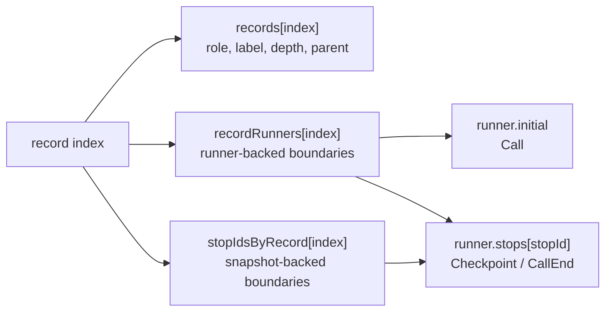
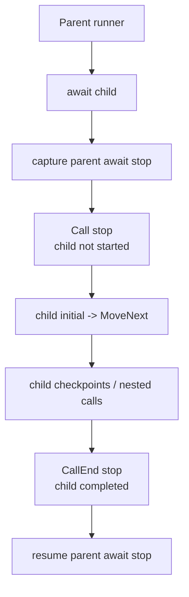
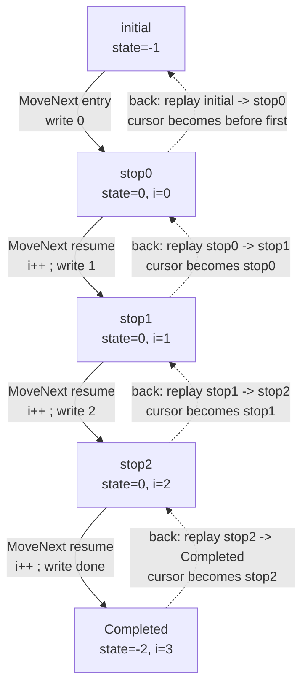

# MinimumPlayback 内部アルゴリズム

この文書は `src/MinimumPlayback` の内部動作を説明します。C# の
async 状態機械をどのように保存し、タイムライン境界として記録し、前へ進め、後方移動のために
replay するかを説明します。

`MinimumPlayback` は意図的に小さい実験実装です。checkpoint、ネストした `PlaybackTask` 呼び出し、
型付き戻り値、call entry / call exit の境界、root completion、後方移動だけを扱います。virtual
time、scheduler、`ValueTask`、一般的な `Task` semantics、user data store はありません。

## 1. 見える動き

次のプログラムを考えます。

```csharp
using MinimumPlayback;
using static MinimumPlayback.PlaybackTask;

var playback = Playback.Create(ForScenario);

Console.WriteLine("-- forward --");
while (playback.TryMoveNext())
{
    Console.WriteLine();
}

Console.WriteLine("-- back --");
while (playback.TryMoveBack())
{
    Console.WriteLine();
}

Console.WriteLine("-- forward --");
while (playback.TryMoveNext())
{
    Console.WriteLine();
}

static async PlaybackTask ForScenario(Playback playback)
{
    for (var i = 0; i < 3; i++)
    {
        Console.Write(i);
        await Checkpoint();
    }

    Console.Write("done");
}
```

出力はこうなります。

```text
-- forward --
0
1
2
done
-- back --
done
2
1
0
-- forward --
0
1
2
done
```

後方移動は C# を逆向きに実行しているわけではありません。1つ前の状態機械 snapshot を復元し、
生成された `MoveNext()` を前向きに実行して現在のタイムライン境界を再現し、その境界を消費して
カーソルを後ろへ動かしています。

```text
forward  = 現在の境界を復元 -> MoveNext -> 次の境界に止まる
backward = 前の境界を復元   -> MoveNext -> 現在の境界を消費する
```

## 2. 基本モデル

C# は `async` メソッドを `IAsyncStateMachine` に lowering します。生成された状態機械は、再開位置、
ローカル変数、awaiter field、`MoveNext()` を持ちます。

`MinimumPlayback` は、この生成された状態機械を実行状態として扱います。user code を解釈するのではなく、
移動境界で状態機械の snapshot を保存します。

主な runtime object は次の3つです。

```text
Playback
  timeline records
  record -> runner map
  record -> runner-local stop id map
  movement cursor
  replay/rewrite mode

PlaybackRunner<TStateMachine>
  initial state-machine snapshot
  current executable snapshot
  stops[] snapshots captured at checkpoints and parent await sites

PlaybackPromise
  child completion state
  parent continuation runner
  parent continuation stop id
```

タイムラインは実行状態そのものではありません。見える移動境界への index です。

```text
record index -> PlaybackRecord metadata
record index -> runner, for runner-backed boundaries
record index -> stop id, for snapshot-backed boundaries
```



`Call` は runner-backed ですが stop-id-backed ではありません。子 runner の `initial` snapshot から始めます。
`Checkpoint` と `CallEnd` は runner と runner-local stop id を持ちます。`Completed` は runner state を
持たない境界です。

## 3. ネスト呼び出しと Call 境界

`Call` はネスト例から見るのが一番分かりやすいです。

```csharp
var playback = Playback.Create(_ => Nest(3, 3));

static async PlaybackTask Nest(int m, int n)
{
    Console.WriteLine($"Entering nest({n})" + (IsForward ? " forward" : " backward"));

    if (n <= 0)
        return;

    for (var i = n; i < m; i++)
    {
        await Checkpoint();
        Console.WriteLine($"In nest({n}) loop {i}" + (IsForward ? " forward" : " backward"));
    }

    await Nest(m, n - 1);

    Console.WriteLine($"Exiting nest({n})" + (IsForward ? " forward" : " backward"));
}
```

前方実行の出力です。

```text
Entering nest(3) forward
Entering nest(2) forward
In nest(2) loop 2 forward
Entering nest(1) forward
In nest(1) loop 1 forward
In nest(1) loop 2 forward
Entering nest(0) forward
Exiting nest(1) forward
Exiting nest(2) forward
Exiting nest(3) forward
```

完了地点から後方移動したときの出力です。

```text
Exiting nest(3) backward
Exiting nest(2) backward
Exiting nest(1) backward
Entering nest(0) backward
In nest(1) loop 2 backward
In nest(1) loop 1 backward
Entering nest(1) backward
In nest(2) loop 2 backward
Entering nest(2) backward
Entering nest(3) backward
```

次の helper で timeline を表示できます。

```csharp
static void DumpRecord(PlaybackRecord record)
{
    Console.WriteLine(
        $"{record.Index, 3}: {string.Concat(Enumerable.Repeat("| ", record.Depth))}{record.Label} depth={record.Depth} parent={record.ParentIndex}"
    );
}

static void Dump(Playback playback)
{
    for (var i = 0; i < playback.Records.Length; i++)
    {
        DumpRecord(playback.Records[i]);
    }
}
```

timeline は次の形になります。

```text
  0: In depth=0 parent=-1
  1: | Checkpoint depth=1 parent=0
  2: | In depth=1 parent=0
  3: | | Checkpoint depth=2 parent=2
  4: | | Checkpoint depth=2 parent=2
  5: | | In depth=2 parent=2
  6: | | Out depth=2 parent=5
  7: | Out depth=1 parent=2
  8: Out depth=0 parent=0
  9: Completed depth=0 parent=-1
```

`Call` record によって、子の状態機械が始まる前に移動を止められます。`Call` から前へ進むと、
子 runner の `initial` state を復元して `MoveNext()` します。`CallEnd` record によって、子が完了した後、
親の await continuation が再開する前にも止められます。



## 4. 生成される状態機械

最初の `ForScenario` は、1つの生成状態機械に lowering されます。実際の名前は compiler によって
変わりますが、重要なのは形です。

```csharp
[StructLayout(LayoutKind.Auto)]
[CompilerGenerated]
private struct ForScenarioStateMachine : IAsyncStateMachine
{
    public int state;
    public PlaybackTaskMethodBuilder builder;

    private int i;
    private CheckpointAwaitable.Awaiter checkpointAwaiter;

    private void MoveNext()
    {
        var num = state;

        try
        {
            if (num != 0)
            {
                i = 0;
                goto LoopTest;
            }

            var awaiter = checkpointAwaiter;
            checkpointAwaiter = default;
            num = state = -1;

        ResumeAfterCheckpoint:
            awaiter.GetResult();
            i++;

        LoopTest:
            if (i < 3)
            {
                Console.Write(i);
                awaiter = PlaybackTask.Checkpoint().GetAwaiter();
                if (!awaiter.IsCompleted)
                {
                    num = state = 0;
                    checkpointAwaiter = awaiter;
                    builder.AwaitUnsafeOnCompleted(ref awaiter, ref this);
                    return;
                }

                goto ResumeAfterCheckpoint;
            }

            Console.Write("done");
        }
        catch (Exception exception)
        {
            state = -2;
            builder.SetException(exception);
            return;
        }

        state = -2;
        builder.SetResult();
    }

    void IAsyncStateMachine.MoveNext() => MoveNext();

    void IAsyncStateMachine.SetStateMachine(IAsyncStateMachine stateMachine)
    {
        builder.SetStateMachine(stateMachine);
    }
}
```

この例で見るべき field は少ないです。

| Field | 意味 |
| --- | --- |
| `state` | compiler が使う再開位置 |
| `i` | user code の loop 変数 |
| `checkpointAwaiter` | 中断した await の契約を表す。`GetResult()` が `await` 後の再開点で、例外を伝播し、await 結果を返す。`Checkpoint()` の結果は void だが、typed child await では同じ形で `T` を返す。 |
| `builder` | `MinimumPlayback` が実行の capture/resume に使う custom builder |

この例で効いてくる状態はほぼ `(state, i)` です。

| Boundary | `state` | `i` |
| --- | ---: | --- |
| `initial` | `-1` | undefined |
| `stop0` | `0` | `0` |
| `stop1` | `0` | `1` |
| `stop2` | `0` | `2` |
| `Completed` | `-2` | `3` |

方向が変わっても、生成された `MoveNext()` は常に前向きに実行されます。変わるのは timeline の
bookkeeping です。



## 5. Builder と Runner の lifecycle

`PlaybackTask` と `PlaybackTask<T>` は custom async method builder を使います。

```csharp
[AsyncMethodBuilder(typeof(PlaybackTaskMethodBuilder))]
public readonly partial struct PlaybackTask;

[AsyncMethodBuilder(typeof(PlaybackTaskMethodBuilder<>))]
public readonly struct PlaybackTask<T>;
```

compiler 生成の状態機械は `AsyncTaskMethodBuilder` ではなく、この custom builder を呼びます。
実際の分岐は `PlaybackTaskMethodBuilderCore` にあります。

### Start

`Start(ref stateMachine)` は現在の async method 用 runner を作ります。

```text
parent = PlaybackRuntime.CurrentRunner
runner = new PlaybackRunner<TStateMachine>(playback, promise, parent)
promise.AttachRunner(runner)
runner.SetInitial(ref stateMachine)
```

root async method の場合:

```text
playback.AttachRootRunner(runner)
runner.MoveNext()
```

root は最初の `TryMoveNext()` で user code を最初の境界まで進める必要があるため、すぐに開始します。

ネストした `PlaybackTask` 呼び出しの場合:

```text
playback.AddCall(parent, childRunner, "In")
```

子はすぐには開始しません。`Call` record が、子が始まる前の移動境界になります。

### CaptureAwait

`CaptureAwait(ref awaiter, ref stateMachine)` は incomplete await の状態を保存します。

```text
awaiter.IsReplaySuspension:
  CaptureReplaySuspension(ref stateMachine, awaiter.ReplayOwnerRecordIndex)

awaiter.CheckpointLabel is label:
  CaptureCheckpoint(ref stateMachine, label)

awaiter.Promise is childPromise:
  parentStopId = CaptureAwait(ref stateMachine)
  childPromise.AddContinuation(parentRunner, parentStopId)
```

checkpoint capture は現在の状態機械を snapshot し、`runner.stops[]` に入れて `Checkpoint` を記録します。
child-await capture は親の await site を snapshot し、その stop id を child promise に登録します。

### Complete

`Complete()` と `Complete<T>(...)` は runner を完了扱いにし、promise を完了させます。

root runner の場合、`MarkCompleted()` が `Completed` を記録します。child runner の場合、promise 完了が
登録済みの parent continuation を通して `CallEnd` を記録します。

```text
child promise completes
parentRunner.CompleteAwait(parentStopId, childCallRecordIndex)
playback.AddCallEnd(parentRunner, parentStopId, childCallRecordIndex)
```

`SetException(...)` も同じ completion path を使い、例外を promise に保存します。

`PlaybackRuntime` は同期的な ambient scope です。

```text
CurrentPlayback
CurrentRunner
```

runner が `MoveNext()` を呼ぶとき、自分自身を `CurrentRunner` に入れます。これにより、ネストした
async method は親 runner を発見できます。

## 6. Timeline Records と Stop Storage

timeline record は小さい value record です。

```csharp
public readonly record struct PlaybackRecord(
    int Index,
    PlaybackRecordRole Role,
    string Label,
    int Depth,
    int ParentIndex
);
```

roles:

```text
Checkpoint  explicit user checkpoint; runner + stop id
Call        child entry boundary; child runner initial state
CallEnd     child completion boundary; parent runner + stop id
Completed   root completion boundary; no runner state
```

4つの role はすべて移動境界です。

storage rules:

```text
Checkpoint:
  recordRunners[index] = owning runner
  stopIdsByRecord[index] = runner-local stop id

Call:
  recordRunners[index] = child runner
  stopIdsByRecord[index] = -1

CallEnd:
  recordRunners[index] = parent runner
  stopIdsByRecord[index] = parent await stop id

Completed:
  recordRunners[index] = null
  stopIdsByRecord[index] = -1
```

`stopIdsByRecord` は実際の stop id をそのまま保存します。stop id がない場合は `-1` です。コードでは
`NoStopId` として定義されています。`-1` sentinel は配列 resize と truncate の場所で維持するので、
restore/resume code は `stopIdsByRecord[index]` を直接使えます。

parent/depth rules:

```text
Call parent       = containing call record, or -1 at root
Checkpoint parent = current call record, or -1 at root
CallEnd parent    = completed child call record
Completed parent  = -1
```

## 7. 前方移動

`Playback.Create(...)` は lazy です。entry delegate を保存するだけで user code はまだ実行しません。
最初の `TryMoveNext()` が root runner を開始し、最初の境界が記録されるまで進めます。

既に次の stop が存在する場合、前方移動は cursor を進めるだけです。

```text
next = FindNextStop(cursor)
cursor = next
Current = records[next]
```

記録済みの次 stop がなく、playback が completed でない場合、runtime は現在の cursor から runner を
復元または再開し、新しい record が追加されるまで `MoveNext()` を実行します。

cursor preparation:

```text
cursor == -1:
  restore root initial
  root.MoveNext()

cursor is Checkpoint:
  restore runner.stops[stopId]
  runner.MoveNext()

cursor is Call:
  restore child runner initial
  child.MoveNext()

cursor is CallEnd:
  reset parent promise for replay
  resume parent await stop

cursor is Completed:
  no forward segment exists
```

前回の後方移動で `Rewriting` mode になっている場合、次の前方移動はまず `rewriteFrom` 以降の record を
truncate し、消した stop id を `-1` で埋めてから、新しい未来を記録します。

## 8. 後方移動

`TryMoveBack()` は C# を逆実行しません。`IsForward == false` の状態で、前向きの区間を replay します。

algorithm:

```text
target = cursor
previous = FindPreviousStop(cursor)
IsForward = false
IsCompleted = false

ReplayExisting(previous, target)

mode = Rewriting
rewriteFrom = previous + 1
cursor = previous
Current = null
```

`ReplayExisting(previous, target)` は replay mode を設定し、`previous` 用の runner を復元し、前方に実行して
`previous + 1` から `target` までの既存 record を消費します。

replay 中、record creation methods は append しません。

```text
AddCheckpoint
AddCall
AddCallEnd
OnRootCompleted
```

かわりに次の既存 record を消費します。role と label は一致しなければいけません。`target` まで正確に
消費できなければ、状態機械の実行と timeline が一致しなくなったということなので例外を投げます。

後方移動が成功すると、cursor は `previous` を指します。ただし古い未来はまだ配列上に残っています。
`Rewriting` mode は、次の前方移動でその未来を truncate してから新しく記録するための印です。

## 9. 型付き結果、例外、Clone

`PlaybackTask<T>` の結果は task struct ではなく `PlaybackPromise<T>` に保存します。task struct は handle で、
child completion と parent continuation の間で共有される実体は promise です。

replay 時、promise は次の状態に戻ります。

```text
completed = false
exception = null
```

continuation runner と stop id の link は残します。これにより、replay された child completion が同じ
`CallEnd` を記録し、後で同じ parent await state を再開できます。

例外は promise に保存され、`GetResult()` から throw されます。

value type の状態機械は代入で snapshot できます。Debug build では生成状態機械が reference type になる
ことがあるため、`MinimumPlayback` は shallow な `MemberwiseClone()` helper を使います。この clone は
状態機械の field をコピーしますが、local が参照している mutable object までは deep copy しません。

## 10. 制約とメンタルモデル

制約:

```text
single-threaded synchronous runtime
no external scheduler
no ValueTask
no general Task semantics
one logical awaiter per PlaybackTask
shallow clone only for reference-type state machines
linear scan for next/previous stop
```

mental model:

| Step | 意味 |
| ---: | --- |
| 1 | C# async method が compiler state machine になる |
| 2 | `PlaybackRunner` がその state machine を snapshot する |
| 3 | `Playback` が見える移動境界を記録する |
| 4 | `TryMoveNext` が restore/resume して `MoveNext()` を実行する |
| 5 | `TryMoveBack` が1つ前の境界を復元し、現在の境界まで前向きに replay する |
| 6 | `Rewriting` が後方移動後の古い未来を truncate する |
