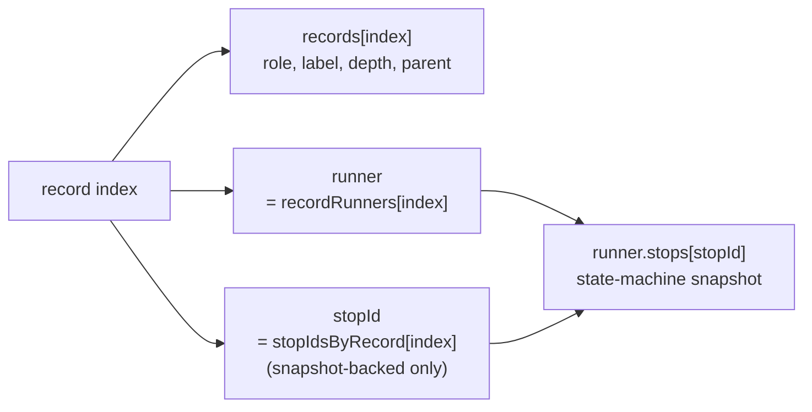
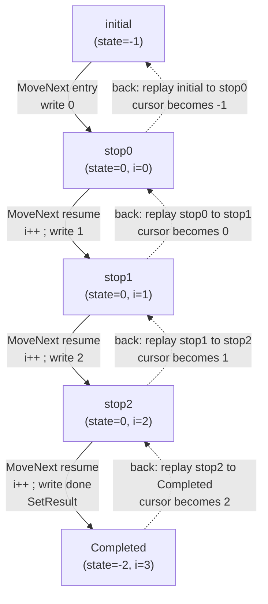
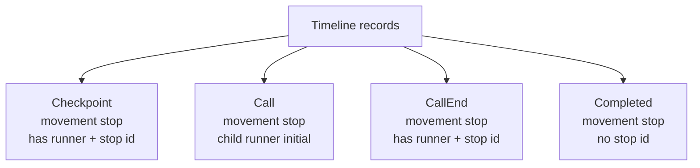
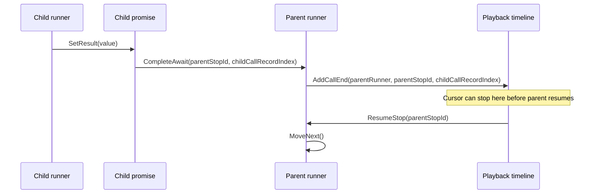
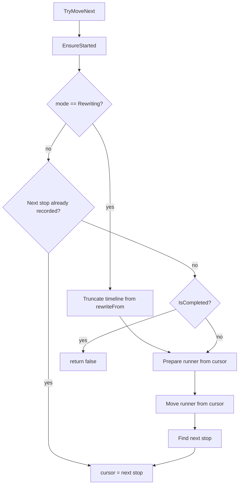
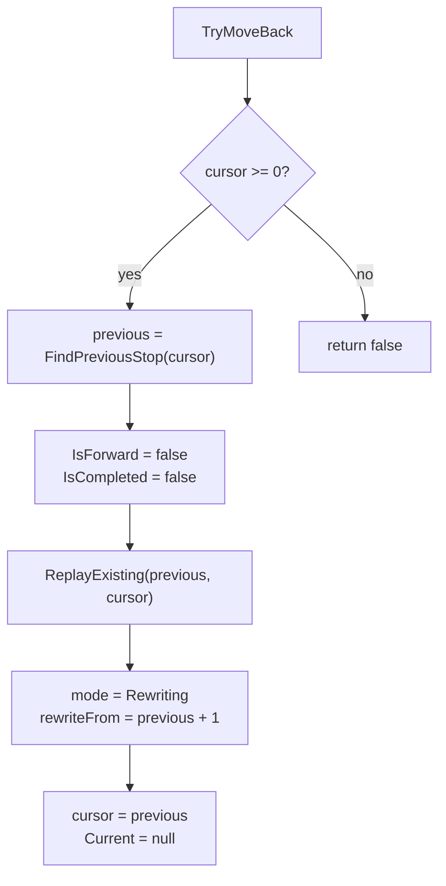
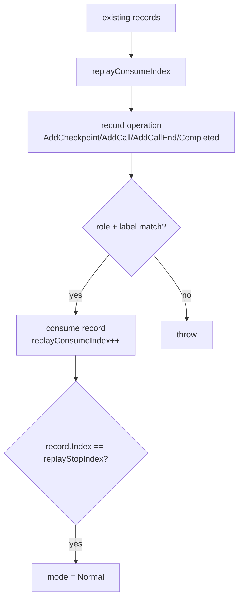
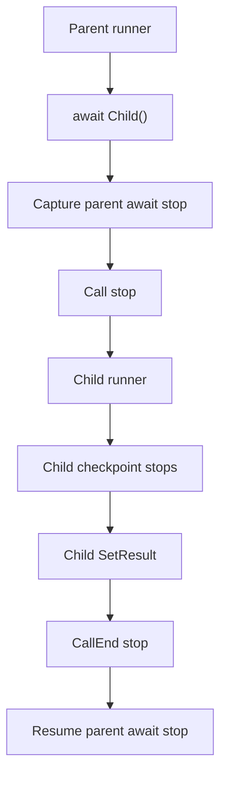

# MinimumPlayback

## 基本の例

次のコードを見ます。

```csharp
using MinimumPlayback;
using static MinimumPlayback.PlaybackTask;

var playback = Playback.Create(ForScenario);

Console.WriteLine("-- forward --");
while (playback.TryMoveNext())
{
    Console.WriteLine();
}

Console.WriteLine("-- back --");
while (playback.TryMoveBack())
{
    Console.WriteLine();
}

Console.WriteLine("-- forward --");
while (playback.TryMoveNext())
{
    Console.WriteLine();
}

static async PlaybackTask ForScenario(Playback playback)
{
    for (var i = 0; i < 3; i++)
    {
        Console.Write(i);
        await Checkpoint();
    }

    Console.Write("done");
}
```

出力はこうなります。

```text
-- forward --
0
1
2
done
-- back --
done
2
1
0
-- forward --
0
1
2
done
```

面白いですね。まるで書かれているコードが全て逆向きになっているようです。
しかし当然そんなことはできないので、単純化した答えを言うとawaitのタイミングで状態を保存していて、それを用いて復元して実行を繰り返しています。

## 基本の考え方

C# の `async` メソッド^[Runtime Asyncは除く、従来のasync]は、コンパイル時に状態機械へ変換されます。

詳しくはこちらの記事がおすすめ
https://blog.neno.dev/entry/2023/05/27/152855

状態機械は、おおまかに言うと次の情報を持ちます。

| フィールド | 役割 |
| -------------- | -------------------- |
| `state` | どこから再開するか |
| awaiter | `await` をまたいで結果を取り出す |
| ローカル変数 | `i` などのローカル変数 |
| builder | async method builder |
| `MoveNext()` | 実際に処理を進める入口 |

`MinimumPlayback` は、このコンパイラ生成の状態機械を実行状態として扱います。

タイムラインは実行状態そのものではありません。実行状態は `PlaybackRunner<TStateMachine>` が持っています。

```csharp
internal sealed class PlaybackRunner<TStateMachine>
    where TStateMachine : IAsyncStateMachine
{
    private TStateMachine initial;
    private TStateMachine current;
    private TStateMachine[] stops;
    private int stopCount;
}
```

`initial` は初回実行前の状態です。`current` は現在動かすコピー。`stops` はチェックポイントなどで保存した状態機械のスナップショットです。

一方、`Playback` はタイムラインとカーソルを持ちます。

```csharp
private PlaybackRecord[] records;
private IPlaybackRunner?[] recordRunners;
private int[] stopIdsByRecord;
private int recordCount;
private int cursor;
```

`records` には見える履歴が入ります。`recordRunners` は runner を持つ境界から runner へたどるための対応表です。`stopIdsByRecord` は checkpoint や call-end のような snapshot-backed boundary から runner 内のスナップショットへたどるための対応表です。



## 生成される状態機械

先ほどの `ForScenario` は、次のような状態機械になります。実際の生成名は環境によって変わるので、名前そのものは気にしなくてかまいません。

```csharp
[StructLayout(LayoutKind.Auto)]
[CompilerGenerated]
private struct ForScenarioStateMachine : IAsyncStateMachine
{
    public int state;
    public PlaybackTaskMethodBuilder builder;

    private int i;
    private CheckpointAwaitable.Awaiter checkpointAwaiter;

    private void MoveNext()
    {
        var num = state;

        try
        {
            if (num != 0)
            {
                i = 0;
                goto LoopTest;
            }

            var awaiter = checkpointAwaiter;
            checkpointAwaiter = default;
            num = state = -1;

        ResumeAfterCheckpoint:
            awaiter.GetResult();
            i++;

        LoopTest:
            if (i < 3)
            {
                Console.Write(i);

                awaiter = PlaybackTask.Checkpoint().GetAwaiter();
                if (!awaiter.IsCompleted)
                {
                    num = state = 0;
                    checkpointAwaiter = awaiter;
                    builder.AwaitUnsafeOnCompleted(ref awaiter, ref this);
                    return;
                }

                goto ResumeAfterCheckpoint;
            }

            Console.Write("done");
        }
        catch (Exception exception)
        {
            state = -2;
            builder.SetException(exception);
            return;
        }

        state = -2;
        builder.SetResult();
    }

    void IAsyncStateMachine.MoveNext()
    {
        MoveNext();
    }

    void IAsyncStateMachine.SetStateMachine(IAsyncStateMachine stateMachine)
    {
        builder.SetStateMachine(stateMachine);
    }
}
```

この例で見るべきフィールドは少ないです。

| フィールド | 中身 |
| ------------------- | -------------------------------------- |
| `state` | コンパイラが使う再開位置 |
| `i` | ユーザーコードのループ変数                          |
| `checkpointAwaiter` | `await Checkpoint()` をまたいで残る awaiter |
| `builder` | `MinimumPlayback` が差し込む custom builder |

このループでは、実行を再現するために効いてくる状態はほぼ `(state, i)` です。

| 名前 | 状態 |
| --------- | ----------------------- |
| initial | `state = -1`, `i` は未初期化 |
| stop0 | `state = 0`, `i = 0` |
| stop1 | `state = 0`, `i = 1` |
| stop2 | `state = 0`, `i = 2` |
| Completed | `state = -2`, `i = 3` |

前方移動では、各停止点から `MoveNext()` を実行して次の停止点へ進みます。



実線は通常の前方実行です。点線は `MoveBack()` です。点線でも `MoveNext()` 自体は前向きに走ります。

## ネストした呼び出し

次のようなコードを考えます。

```csharp
var playback = Playback.Create(_ => Nest(3, 3));

static async PlaybackTask Nest(int m, int n)
{
    Console.WriteLine($"Entering nest({n})" + (IsForward ? " forward" : " backward"));

    if (n <= 0)
    {
        return;
    }
    for (var i = n; i < m; i++)
    {
        await Checkpoint();
        Console.WriteLine($"In nest({n}) loop {i}" + (IsForward ? " forward" : " backward"));
    }

    await Nest(m, n - 1);

    Console.WriteLine($"Exiting nest({n})" + (IsForward ? " forward" : " backward"));
}
```

この例では、各 `Nest(...)` 呼び出しが子 runner になります。`Call` record は、その子 runner がまだ始まっていない入口の停止点です。

前方実行では次のように出ます。

```text
Entering nest(3) forward
Entering nest(2) forward
In nest(2) loop 2 forward
Entering nest(1) forward
In nest(1) loop 1 forward
In nest(1) loop 2 forward
Entering nest(0) forward
Exiting nest(1) forward
Exiting nest(2) forward
Exiting nest(3) forward
```

完了地点から戻ると、同じ区間を `IsForward == false` で前向きに replay するので、次の順に出ます。

```text
Exiting nest(3) backward
Exiting nest(2) backward
Exiting nest(1) backward
Entering nest(0) backward
In nest(1) loop 2 backward
In nest(1) loop 1 backward
Entering nest(1) backward
In nest(2) loop 2 backward
Entering nest(2) backward
Entering nest(3) backward
```

タイムラインは次の形になります。

```text
  0: In depth=0 parent=-1
  1: | Checkpoint depth=1 parent=0
  2: | In depth=1 parent=0
  3: | | Checkpoint depth=2 parent=2
  4: | | Checkpoint depth=2 parent=2
  5: | | In depth=2 parent=2
  6: | | Out depth=2 parent=5
  7: | Out depth=1 parent=2
  8: Out depth=0 parent=0
  9: Completed depth=0 parent=-1
```

## async method builder で差し込む

`MinimumPlayback` は custom async method builder を使います。

```csharp
[AsyncMethodBuilder(typeof(PlaybackTaskMethodBuilder))]
public readonly partial struct PlaybackTask
{
}

[AsyncMethodBuilder(typeof(PlaybackTaskMethodBuilder<>))]
public readonly struct PlaybackTask<T>
{
}
```

これで、コンパイラ生成の状態機械は通常の `AsyncTaskMethodBuilder` ではなく、`PlaybackTaskMethodBuilder` を呼びます。

主に使う入口は次の4つです。

```csharp
public void Start<TStateMachine>(ref TStateMachine stateMachine)
    where TStateMachine : IAsyncStateMachine;

public void AwaitOnCompleted<TAwaiter, TStateMachine>(
    ref TAwaiter awaiter,
    ref TStateMachine stateMachine)
    where TAwaiter : INotifyCompletion
    where TStateMachine : IAsyncStateMachine;

public void SetResult();

public void SetException(Exception exception);
```

runner の作成、停止点の保存、promise の完了、タイムラインへの記録はここから始まります。

## Runtime Scope

`PlaybackRuntime` は、現在の `Playback` と runner を持ち回るための同期スコープです。

```csharp
internal static class PlaybackRuntime
{
    public static Playback? CurrentPlayback { get; set; }
    public static IPlaybackRunner? CurrentRunner { get; set; }
}
```

runner が `MoveNext()` を呼ぶとき、自分自身をこのスコープに入れます。

そのおかげで、`PlaybackTaskMethodBuilder.Create()` は「今作られている async メソッドがどの `Playback` に属するか」を拾えます。ネストした async 呼び出しでも、親 runner が分かります。

これは単一スレッドで同期的に動く前提の仕組みです。普通の async スケジューラとしては使いません。

## Playback

`Playback` はタイムラインとカーソルを持つオブジェクトです。

```csharp
private PlaybackRecord[] records;
private IPlaybackRunner?[] recordRunners;
private int[] stopIdsByRecord;
private int recordCount;
private int cursor;
```

移動モードも持ちます。

```csharp
private PlaybackMode mode;
private int rewriteFrom;
private int replayConsumeIndex;
private int replayStopIndex;
```

モードは3つです。

| モード | 動き |
| ----------- | -------------------------- |
| `Normal` | 通常の記録、または既存レコード上の前方移動 |
| `Rewriting` | 後方移動後、古い未来を切ってから新しいレコードを書く |
| `Replaying` | 既存レコードを追加せずに消費する |

`Rewriting` と `Replaying` が分かれているのが、この実装を追うときのポイントです。戻るときは既存レコードを検証しながら消費します。戻ったあとに前へ進むときは、そこから先を作り直します。

## PlaybackRunner

async メソッドの呼び出し1回につき、runner が1つできます。

```csharp
internal sealed class PlaybackRunner<TStateMachine>
    where TStateMachine : IAsyncStateMachine
{
    private TStateMachine initial;
    private TStateMachine current;
    private TStateMachine[] stops;
    private int stopCount;
}
```

`stops` には、チェックポイントや親 await site で保存した状態機械スナップショットが入ります。

checkpoint record と call-end record は、この runner-local stop id を使って復元対象を指します。`Call` record は stop id を持たず、子 runner の `initial` state から開始します。

## PlaybackPromise

`PlaybackPromise` は普通の `Task` ではありません。

想定しているのは、1つの子 playback task、1つの親 await site、1つの continuation stop という対応です。

```csharp
internal sealed class PlaybackPromise
{
    private IPlaybackRunner? continuationRunner;
    private int continuationId;

    private Exception? exception;
    private bool completed;
}
```

`PlaybackTask<T>` 用の `PlaybackPromise<T>` は結果も持ちます。

```csharp
internal sealed class PlaybackPromise<T>
{
    private T? result;

    private IPlaybackRunner? continuationRunner;
    private int continuationId;

    private Exception? exception;
    private bool completed;
}
```

子が完了すると、任意の `Action` を呼ぶのではなく、保存済みの runner stop を再開します。

```csharp
continuationRunner.CompleteAwait(
    continuationId,
    childCallRecordIndex);
```

ここで `Action` を使わないのは自然です。`Action` だと mutable な現在状態をつかみやすい。stop id なら、明示的に保存した状態機械スナップショットを指せます。

## Timeline Records

タイムラインの1レコードは次の形です。

```csharp
public readonly record struct PlaybackRecord(
    int Index,
    PlaybackRecordRole Role,
    string Label,
    int Depth,
    int ParentIndex
);
```

ロールは4種類です。

```csharp
public enum PlaybackRecordRole
{
    Checkpoint,
    Call,
    CallEnd,
    Completed
}
```

それぞれの扱いはこうです。

| ロール | 移動先になるか | runner stop を持つか | 用途 |
| ------------ | ------: | ---------------: | ----------------- |
| `Checkpoint` | はい | はい | 明示的な停止点 |
| `Call` | はい | いいえ | 子 runner の入口 |
| `CallEnd` | はい | はい | 子 async メソッドの完了境界 |
| `Completed` | はい | いいえ | root メソッドの完了境界 |

`Call` は `recordRunners[index]` で子 runner を指しますが、`stopIdsByRecord[index]` は `-1` のままです。子 runner の `initial` state から開始できるため、runner-local stop id は不要です。



親子関係は、移動カーソルとは別に持ちます。

`Call` の親は、それを含む call record です。`Checkpoint` の親は、現在の call record です。`CallEnd` の親は、完了した子 call record です。

## 停止点の保存

checkpoint では、現在の状態機械を保存して、その stop id をタイムラインに書きます。

`Call` record は runner stop id を持ちません。かわりに、record から子 runner へ直接たどり、その子 runner の `initial` state から開始します。

```text
record index
  -> records[index]
  -> child runner in recordRunners[index]
  -> child runner initial state
```

```csharp
void CaptureCheckpoint<TStateMachine>(
    PlaybackRunner<TStateMachine> runner,
    ref TStateMachine stateMachine,
    string label)
    where TStateMachine : IAsyncStateMachine
{
    var snapshot = SnapshotStateMachine(stateMachine);
    var stopId = runner.AddStop(snapshot);

    playback.AddCheckpoint(runner, stopId, label);
}
```

親が子を `await` するときも、親の await 状態を保存します。

```csharp
void CaptureAwait<TStateMachine>(
    PlaybackRunner<TStateMachine> parentRunner,
    ref TStateMachine parentStateMachine,
    PlaybackPromise childPromise)
    where TStateMachine : IAsyncStateMachine
{
    var snapshot = SnapshotStateMachine(parentStateMachine);
    var stopId = parentRunner.AddStop(snapshot);

    childPromise.AddContinuation(parentRunner, stopId);
}
```

子が完了すると、親の continuation stop に紐づいた `CallEnd` ができます。

```csharp
void CompleteChild(
    PlaybackPromise childPromise,
    IPlaybackRunner parentRunner,
    int parentStopId,
    int childCallRecordIndex)
{
    childPromise.SetResult();

    parentRunner.CompleteAwait(
        parentStopId,
        childCallRecordIndex);

    playback.AddCallEnd(
        parentRunner,
        parentStopId,
        childCallRecordIndex);
}
```

call-end から前へ進むときは、保存した親 await 状態を再開します。

```csharp
void ResumeFromCallEnd(PlaybackRecord record)
{
    var runner = recordRunners[record.Index];
    var stopId = stopIdsByRecord[record.Index];

    runner.ResumeStop(stopId);
}
```

checkpoint から前へ進むときは、runner stop を復元してから `MoveNext()` します。

```csharp
void RestoreFromCheckpoint(PlaybackRecord record)
{
    var runner = recordRunners[record.Index];
    var stopId = stopIdsByRecord[record.Index];

    runner.RestoreStop(stopId, record.Index);
}
```

root の完了は停止境界ですが、復元対象ではありません。

```csharp
void CompleteRoot()
{
    playback.AddCompleted();
}
```

完了地点から戻るときは、1つ前の停止点を復元し、完了レコードが再現されるまで前向きに replay します。



## 前方移動

`Playback.Create(...)` では、まだユーザーコードを実行しません。最初の `TryMoveNext()` で root async メソッドが動き始めます。

流れは次のようになります。

```csharp
bool TryMoveNext()
{
    IsForward = true;
    EnsureStarted();

    if (mode == PlaybackMode.Rewriting)
    {
        TruncateFrom(rewriteFrom);
        PrepareRunnerFromCursor();
        MoveRunnerFromCursor();
        cursor = FindNextStop(cursor);
        return true;
    }

    var next = FindNextStop(cursor);
    if (next >= 0)
    {
        cursor = next;
        return true;
    }

    if (IsCompleted)
    {
        return false;
    }

    PrepareRunnerFromCursor();
    MoveRunnerFromCursor();
    cursor = FindNextStop(cursor);

    return true;
}
```

カーソル位置ごとの再開方法はこうです。

| カーソル位置 | 動き |
| ------------ | ----------------------------------------------- |
| `-1` | root の initial state を復元して `MoveNext()`|
| `Checkpoint` | runner の stop snapshot を復元して `MoveNext()` |
| `Call` | 子 runner の initial state を復元して `MoveNext()` |
| `CallEnd` | replay 用に promise を整えて、親 await continuation を再開 |

通常モードでは、call、checkpoint、call-end、completed が発生すると新しい停止レコードを追加します。



## 後方移動

後方移動は、前の停止点から現在の停止点までを再実行する処理です。

例えば次のコードがあるとします。

```csharp
for (var i = 0; i < 5; i++)
{
    Console.Write(IsForward ? $"F{i}" : $"B{i}");
    await Checkpoint();
}
```

前へ進むと、`F0 F1 F2 F3 F4` の順に出ます。

戻ると、`B4 B3 B2 B1 B0` の順に出ます。

各 backward step は、現在の停止点で終わる区間を replay しています。その間、`IsForward` は `false` です。

処理の形は次のとおりです。

```csharp
bool TryMoveBack()
{
    EnsureStarted();

    if (cursor < 0)
    {
        return false;
    }

    var target = cursor;
    var previous = FindPreviousStop(cursor);

    IsForward = false;
    IsCompleted = false;

    ReplayExisting(previous, target);

    mode = PlaybackMode.Rewriting;
    rewriteFrom = previous + 1;
    cursor = previous;
    Current = null;

    return true;
}
```

`ReplayExisting(previous, target)` は、新しいレコードを追加しません。既存のタイムラインを `previous + 1` から `target` まで順に消費します。

再実行された処理が既存タイムラインと合わなければ、そこで例外を投げます。分岐が変わっていたら、同じ停止点まで再現できないからです。



## 既存レコードの replay

`PlaybackMode.Replaying` の間は、`AddCheckpoint`、`AddCall`、`AddCallEnd`、root completion がレコードを追加しません。

かわりに、次に消費する既存レコードと照合します。

```csharp
void ConsumeReplayRecord(PlaybackRecordRole role, string label)
{
    var expected = records[replayConsumeIndex];

    if (expected.Role != role || expected.Label != label)
    {
        throw new InvalidOperationException(
            "Replay diverged from the existing timeline.");
    }

    replayConsumeIndex++;

    if (expected.Index == replayStopIndex)
    {
        mode = PlaybackMode.Normal;
        replayConsumeIndex = -1;
        replayStopIndex = -1;
    }
}
```

見ているのは role と label です。ここがズレたら、制御フローが前回と変わっています。

この設計だと、戻る操作のたびに「その区間をもう一度前向きに実行できるか」を確認できます。雑にカーソルだけ動かすより安全です。



## 戻ったあとの書き換え

`TryMoveBack()` のあと、カーソルは前の停止点を指しています。ただし、タイムライン上にはその先のレコードがまだ残っています。

次に前へ進むときは `Rewriting` モードに入り、古い未来を切ってから新しいレコードを書きます。

```csharp
void TruncateFrom(int rewriteFrom)
{
    Array.Clear(records, rewriteFrom, recordCount - rewriteFrom);
    Array.Clear(recordRunners, rewriteFrom, recordCount - rewriteFrom);
    Array.Fill(stopIdsByRecord, -1, rewriteFrom, recordCount - rewriteFrom);

    recordCount = rewriteFrom;
    mode = PlaybackMode.Normal;
}
```

その後、カーソル位置の runner を復元または再開し、通常どおり実行します。

この動きで、過去に戻ってから別の未来を作る、という挙動になります。

## ネスト呼び出しの扱い

ネストした `async PlaybackTask` が呼ばれると、子 runner が作られます。

```csharp
void CreateChildRunner<TStateMachine>(
    Playback playback,
    PlaybackRunner<TStateMachine> child,
    IPlaybackRunner parent)
    where TStateMachine : IAsyncStateMachine
{
    child.Depth = parent.Depth + 1;
    child.CallRecordIndex = playback.AddCall(parent, child, "In");

    parent.AddChild(child);
}
```

`Call` record は子 runner の入口停止点です。ここで移動を止められるので、子の状態機械が始まる前の境界をタイムライン上で扱えます。

子が終わると、promise が完了します。この最小モデルでは call-end を必ず停止点として記録します。親はその次の移動ステップで await continuation から再開します。



この `CallEnd` があるおかげで、次のような境界をはっきり扱えます。

1. 子呼び出しの入口 `Call` に止まる
2. 子の中の checkpoint に止まる
3. 子が完了する
4. 親の continuation に戻る
5. 親側の checkpoint に止まる

`CallEnd` がないと、3 と 4 が同じ移動に混ざります。戻るときにどこへ戻ったのか分かりにくくなります。

## 型付き戻り値

`PlaybackTask<T>` は `PlaybackPromise<T>` に結果を入れます。

```csharp
internal sealed class PlaybackPromise<T>
{
    private T? result;

    public void SetResult(T result)
    {
        this.result = result;
        completed = true;
    }

    public T GetResult()
    {
        if (exception is not null)
        {
            throw exception;
        }

        return result!;
    }
}
```

結果は task struct ではなく promise に属します。

`PlaybackTask<T>` は軽量なハンドルです。子の完了と親の再開の間で安定して共有される実体は promise です。

replay 時には、promise の完了状態を戻します。

```csharp
void ResetForReplay()
{
    completed = false;
    exception = null;

    // continuationRunner と continuationId は残す
}
```

continuation のリンクは残します。同じ子完了を再実行して、同じ親 await stop を再び再開するためです。

## Debug ビルドでの状態機械コピー

Release ビルドでは、async 状態機械は value type です。代入でコピーできます。

Debug ビルドでは reference type になります。その場合、単純な代入では参照をコピーするだけです。過去の checkpoint が、あとから変わった状態を見てしまいます。

そのため、reference type の状態機械は shallow clone します。

```csharp
private static TStateMachine SnapshotStateMachine(TStateMachine source)
{
    if (typeof(TStateMachine).IsValueType)
    {
        return source;
    }

    if (source == null)
    {
        throw new InvalidOperationException("State machine is null.");
    }

    return CloneUtility.Clone(source);
}
```

deep clone ではありません。状態機械のフィールド自体をコピーするだけです。

ローカル変数が参照している mutable object まではコピーしません。そこまでやると、この実験の範囲を超えます。

## 制限

この実装はかなり小さく作られています。

対応していないものは多いです。

* スレッドセーフではない
* 外部スケジューラはない
* `ValueTask` は扱わない
* 参照型ローカル変数の deep clone はしない
* replay 中に分岐がズレたときの回復処理はない
* public な拡張モデルはない
* 次の停止点、前の停止点は線形スキャンで探す

線形スキャンの対象はタイムラインレコードです。今は `Call` も停止点なので、実用上は「移動境界ではないレコード」がどれだけ挟まるかが問題になります。

必要になったら stop index を足せばいいと思います。今の段階では、まず動きの意味が読み取れることのほうが大事です。

## まとめ

`MinimumPlayback` の考え方は、かなり短く言えます。

C# の `async` メソッドは状態機械になる。
runner は、その状態機械のスナップショットを持つ。
timeline は、見えるイベントと停止点への索引を持つ。
前に進むときは、停止点から復元して `MoveNext()` する。
戻るときは、1つ前の停止点から現在の停止点まで前向きに replay する。
ネストした async 呼び出しでは、`Call` を子入口の停止点、`CallEnd` を子完了の停止点にして親子の境界を残す。

タイムラインは実行状態そのものではありません。実行状態は runner 側の状態機械スナップショットです。

ここを分けて読むと、実装全体がかなり追いやすくなります。巻き戻しに見える動きも、実際は「保存した状態からの再実行」。仕組みとしては単純ですが、だからこそ面白いと思っています。
