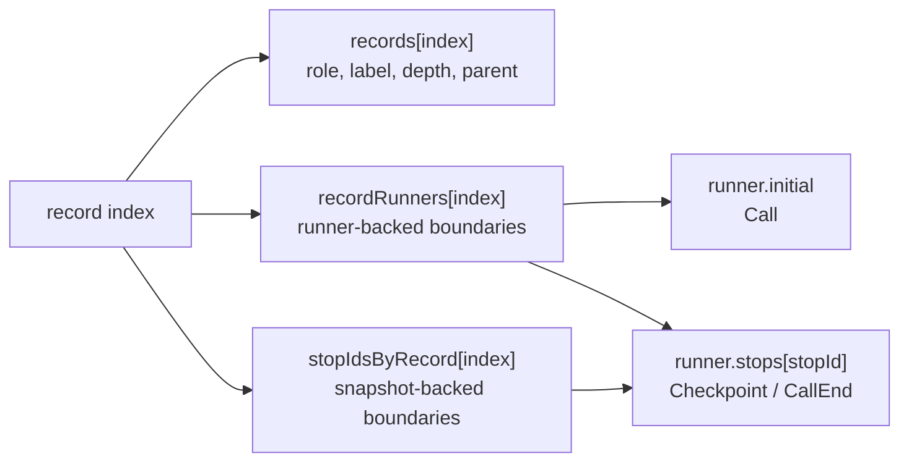
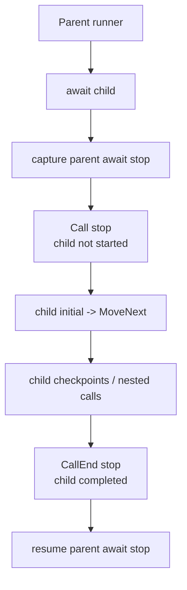
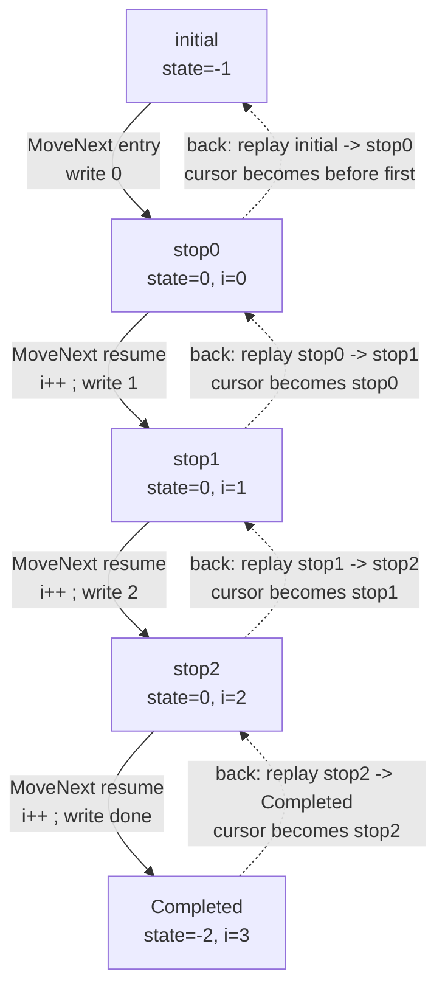

# MinimumPlayback の内部アルゴリズム

この文書では、`src/MinimumPlayback` の内部動作を説明します。C# の async 状態機械をどのように保存し、タイムライン上の境界として記録し、前へ進め、後方移動のためにリプレイするのかを扱います。

`MinimumPlayback` は、意図的に小さく作った実験的な実装です。扱うのは、checkpoint、ネストした `PlaybackTask` 呼び出し、型付き戻り値、call entry / call exit の境界、root completion、後方移動だけです。virtual time、scheduler、`ValueTask`、一般的な `Task` semantics、user data store は扱いません。

## 見える動き

次のプログラムを考えます。

```csharp
using MinimumPlayback;
using static MinimumPlayback.PlaybackTask;

var playback = Playback.Create(ForScenario);

Console.WriteLine("-- forward --");
while (playback.TryMoveNext())
{
    Console.WriteLine();
}

Console.WriteLine("-- back --");
while (playback.TryMoveBack())
{
    Console.WriteLine();
}

Console.WriteLine("-- forward --");
while (playback.TryMoveNext())
{
    Console.WriteLine();
}

static async PlaybackTask ForScenario(Playback playback)
{
    for (var i = 0; i < 3; i++)
    {
        Console.Write(i);
        await Checkpoint();
    }

    Console.Write("done");
}
```

出力は次のようになります。

```text
-- forward --
0
1
2
done
-- back --
done
2
1
0
-- forward --
0
1
2
done
```

後方移動といっても、C# のコードを逆向きに実行しているわけではありません。1つ前の状態機械のスナップショットを復元し、生成された `MoveNext()` を通常どおり前向きに実行して現在のタイムライン境界を再現します。そのうえで、その境界を消費してカーソルを1つ後ろへ動かします。

| 移動 | 動き |
| --- | --- |
| Forward | 現在の境界を復元し、`MoveNext()` を実行して、次の境界で止まる。 |
| Backward | 1つ前の境界を復元し、`MoveNext()` を前向きに実行して現在の境界を再現し、その境界を消費する。 |

## 基本モデル

C# は `async` メソッドを `IAsyncStateMachine` に lowering します。生成された状態機械は、再開位置、ローカル変数、awaiter field、`MoveNext()` を持ちます。

`MinimumPlayback` は、この生成された状態機械を実行状態として扱います。ユーザーコードを解釈するのではなく、移動境界ごとに状態機械のスナップショットを保存します。

主な runtime object は次の3つです。

| Object | 持つもの |
| --- | --- |
| `Playback` | timeline record、record から runner への map、record から stop id への map、移動 cursor、replay/rewrite mode |
| `PlaybackRunner<TStateMachine>` | 初期状態機械のスナップショット、現在実行するスナップショット、checkpoint と parent await site で保存した `stops[]` |
| `PlaybackPromise` | 子の完了状態、親 continuation runner、親 continuation stop id |

タイムラインは実行状態そのものではありません。見える移動境界を指す index です。

| Lookup | 意味 |
| --- | --- |
| `record index -> PlaybackRecord` | 表示される timeline record の metadata |
| `record index -> runner` | `Call`、`Checkpoint`、`CallEnd` など runner-backed boundary の runner |
| `record index -> stop id` | `Checkpoint`、`CallEnd` など snapshot-backed boundary の runner-local snapshot id |



`Call` は runner-backed ですが、stop-id-backed ではありません。子 runner の `initial` スナップショットから開始します。`Checkpoint` と `CallEnd` は runner と runner-local stop id を持ちます。`Completed` は runner state を持たない境界です。

## ネスト呼び出しと Call 境界

`Call` は、ネストした例を見ると分かりやすいです。

```csharp
var playback = Playback.Create(_ => Nest(3, 3));

static async PlaybackTask Nest(int m, int n)
{
    Console.WriteLine($"Entering nest({n})" + (IsForward ? " forward" : " backward"));

    if (n <= 0)
        return;

    for (var i = n; i < m; i++)
    {
        await Checkpoint();
        Console.WriteLine($"In nest({n}) loop {i}" + (IsForward ? " forward" : " backward"));
    }

    await Nest(m, n - 1);

    Console.WriteLine($"Exiting nest({n})" + (IsForward ? " forward" : " backward"));
}
```

前方実行の出力です。

```text
Entering nest(3) forward
Entering nest(2) forward
In nest(2) loop 2 forward
Entering nest(1) forward
In nest(1) loop 1 forward
In nest(1) loop 2 forward
Entering nest(0) forward
Exiting nest(1) forward
Exiting nest(2) forward
Exiting nest(3) forward
```

完了地点から後方移動すると、次のように出力されます。

```text
Exiting nest(3) backward
Exiting nest(2) backward
Exiting nest(1) backward
Entering nest(0) backward
In nest(1) loop 2 backward
In nest(1) loop 1 backward
Entering nest(1) backward
In nest(2) loop 2 backward
Entering nest(2) backward
Entering nest(3) backward
```

次の helper で timeline を表示できます。

```csharp
static void DumpRecord(PlaybackRecord record)
{
    Console.WriteLine(
        $"{record.Index, 3}: {string.Concat(Enumerable.Repeat("| ", record.Depth))}{record.Label} depth={record.Depth} parent={record.ParentIndex}"
    );
}

static void Dump(Playback playback)
{
    for (var i = 0; i < playback.Records.Length; i++)
    {
        DumpRecord(playback.Records[i]);
    }
}
```

timeline は次の形になります。

```text
  0: In depth=0 parent=-1
  1: | Checkpoint depth=1 parent=0
  2: | In depth=1 parent=0
  3: | | Checkpoint depth=2 parent=2
  4: | | Checkpoint depth=2 parent=2
  5: | | In depth=2 parent=2
  6: | | Out depth=2 parent=5
  7: | Out depth=1 parent=2
  8: Out depth=0 parent=0
  9: Completed depth=0 parent=-1
```

`Call` record があることで、子の状態機械が始まる直前に移動を止められます。`Call` から前へ進むと、子 runner の `initial` state を復元して `MoveNext()` します。さらに `CallEnd` record によって、子が完了した直後、親の await continuation が再開する直前にも止められます。



## 生成される状態機械

最初の `ForScenario` は、1つの生成状態機械に lowering されます。実際の名前は compiler によって変わりますが、重要なのはおおよそ次の形です。

```csharp
[StructLayout(LayoutKind.Auto)]
[CompilerGenerated]
private struct ForScenarioStateMachine : IAsyncStateMachine
{
    public int state;
    public PlaybackTaskMethodBuilder builder;

    private int i;
    private CheckpointAwaitable.Awaiter checkpointAwaiter;

    private void MoveNext()
    {
        var num = state;

        try
        {
            if (num != 0)
            {
                i = 0;
                goto LoopTest;
            }

            var awaiter = checkpointAwaiter;
            checkpointAwaiter = default;
            num = state = -1;

        ResumeAfterCheckpoint:
            awaiter.GetResult();
            i++;

        LoopTest:
            if (i < 3)
            {
                Console.Write(i);
                awaiter = PlaybackTask.Checkpoint().GetAwaiter();
                if (!awaiter.IsCompleted)
                {
                    num = state = 0;
                    checkpointAwaiter = awaiter;
                    builder.AwaitUnsafeOnCompleted(ref awaiter, ref this);
                    return;
                }

                goto ResumeAfterCheckpoint;
            }

            Console.Write("done");
        }
        catch (Exception exception)
        {
            state = -2;
            builder.SetException(exception);
            return;
        }

        state = -2;
        builder.SetResult();
    }

    void IAsyncStateMachine.MoveNext() => MoveNext();

    void IAsyncStateMachine.SetStateMachine(IAsyncStateMachine stateMachine)
    {
        builder.SetStateMachine(stateMachine);
    }
}
```

この例で見るべき field は多くありません。

| Field | 意味 |
| --- | --- |
| `state` | compiler が使う再開位置 |
| `i` | ユーザーコードの loop 変数 |
| `checkpointAwaiter` | 中断した await の契約を表す。`GetResult()` が `await` 後の再開点で、例外を伝播し、await 結果を返す。`Checkpoint()` の結果は void だが、typed child await では同じ形で `T` を返す。 |
| `builder` | `MinimumPlayback` が実行の capture/resume に使う custom builder |

この例で状態の差分として重要なのは、ほぼ `(state, i)` です。

| Boundary | `state` | `i` |
| --- | ---: | --- |
| `initial` | `-1` | undefined |
| `stop0` | `0` | `0` |
| `stop1` | `0` | `1` |
| `stop2` | `0` | `2` |
| `Completed` | `-2` | `3` |

方向が変わっても、生成された `MoveNext()` は常に前向きに実行されます。変わるのは timeline の bookkeeping だけです。



## Builder と Runner の lifecycle

`PlaybackTask` と `PlaybackTask<T>` は custom async method builder を使います。

```csharp
[AsyncMethodBuilder(typeof(PlaybackTaskMethodBuilder))]
public readonly partial struct PlaybackTask;

[AsyncMethodBuilder(typeof(PlaybackTaskMethodBuilder<>))]
public readonly struct PlaybackTask<T>;
```

compiler が生成する状態機械は `AsyncTaskMethodBuilder` ではなく、この custom builder を呼びます。実際の分岐は `PlaybackTaskMethodBuilderCore` にあります。

### Start

`Start(ref stateMachine)` は、lowering された async method 用の runner を作ります。

| Step | 操作 | 目的 |
| ---: | --- | --- |
| 1 | `PlaybackRuntime.CurrentRunner` を読む。 | 親 runner を見つける。root なら `null`。 |
| 2 | `PlaybackRunner<TStateMachine>` を作る。 | 生成された状態機械を playback 実行に結びつける。 |
| 3 | runner を method promise に attach する。 | awaiter と typed result が同じ completion object を参照できるようにする。 |
| 4 | 初期状態機械のスナップショットを保存する。 | root start と `Call` replay で使う entry state を残す。 |

root method と nested method では、ここから処理が分かれます。

| Case | 操作 | 効果 |
| --- | --- | --- |
| Root method | root runner として attach し、すぐ `MoveNext()` する。 | 最初の `TryMoveNext()` がユーザーコードを最初の境界まで実行する。 |
| Nested `PlaybackTask` | child runner を持つ `Call` を記録する。 | 子が始まる前に移動を止める。子は playback が `Call` から前へ進むときだけ実行される。 |

### CaptureAwait

`CaptureAwait(ref awaiter, ref stateMachine)` は incomplete await の状態を保存します。

| Awaiter case | 保存する状態 | Timeline effect |
| --- | --- | --- |
| Replay suspension | 現在の状態機械と replay owner record index。 | 新しい record を append せず replay に戻る。 |
| Checkpoint label | 現在の状態機械を `runner.stops[]` に保存する。 | `Checkpoint` を記録または消費する。 |
| Child promise | 親の await-site 状態機械を `runner.stops[]` に保存する。 | child promise に parent continuation を登録する。 |

checkpoint capture は、ユーザーが移動できる見える stop を作ります。child-await capture は、あとで `CallEnd` が使う parent continuation stop を作ります。

### Complete

`Complete()` と `Complete<T>(...)` は runner を完了扱いにし、promise を完了させます。

root runner では、`MarkCompleted()` が `Completed` を記録します。child runner では、promise 完了後、登録済みの parent continuation を通して `CallEnd` を記録します。

| Runner | Completion path | Timeline effect |
| --- | --- | --- |
| Root | `MarkCompleted()`。 | `Completed` を記録または消費する。 |
| Child | promise を完了し、登録済み parent continuation を `CompleteAwait(...)` で再開する。 | `CallEnd` を記録または消費する。 |

`SetException(...)` も同じ completion path を使い、例外を promise に保存します。

`PlaybackRuntime` は同期的な ambient scope です。

| Slot | 意味 |
| --- | --- |
| `CurrentPlayback` | 生成された `MoveNext()` を実行中の playback instance。 |
| `CurrentRunner` | 生成された `MoveNext()` を実行中の runner。 |

runner が `MoveNext()` を呼ぶとき、自分自身を `CurrentRunner` に入れます。これにより、ネストした async method は親 runner を見つけられます。

## Timeline Records と Stop Storage

timeline record は小さな value record です。

```csharp
public readonly record struct PlaybackRecord(
    int Index,
    PlaybackRecordRole Role,
    string Label,
    int Depth,
    int ParentIndex
);
```

roles:

| Role | 意味 | runtime state |
| --- | --- | --- |
| `Checkpoint` | ユーザーが明示した checkpoint | runner + stop id |
| `Call` | 子 runner の入口境界 | child runner initial state |
| `CallEnd` | 子 runner の完了境界 | parent runner + stop id |
| `Completed` | root runner の完了境界 | runner state なし |

4つの role は、いずれも移動境界です。

storage rules:

| Role | `recordRunners[index]` | `stopIdsByRecord[index]` |
| --- | --- | --- |
| `Checkpoint` | owning runner | runner-local stop id |
| `Call` | child runner | `-1` |
| `CallEnd` | parent runner | parent await stop id |
| `Completed` | `null` | `-1` |

`stopIdsByRecord` は実際の stop id をそのまま保存します。stop id がない場合は `-1` です。コード上では `NoStopId` として定義されています。`-1` sentinel は配列の resize と truncate の場所で維持されるため、restore/resume code は `stopIdsByRecord[index]` を直接使えます。

parent/depth rules:

| Role | `ParentIndex` |
| --- | --- |
| `Call` | 親となる call record。root では `-1`。 |
| `Checkpoint` | 現在の call record。root では `-1`。 |
| `CallEnd` | 完了した child call record。 |
| `Completed` | `-1`。 |

## 前方移動

`Playback.Create(...)` は lazy です。entry delegate を保存するだけで、この時点ではユーザーコードを実行しません。最初の `TryMoveNext()` が root runner を開始し、最初の境界が記録されるまで進めます。

すでに次の stop が存在する場合、前方移動は cursor を進めるだけです。

| Step | 操作 |
| ---: | --- |
| 1 | `cursor` の次にある timeline stop を探す。 |
| 2 | `cursor` をその record index にする。 |
| 3 | `Current` をその record にする。 |

記録済みの次 stop がなく、playback が completed でもない場合、runtime は現在の cursor から runner を復元または再開し、新しい record が追加されるまで `MoveNext()` を実行します。

cursor preparation:

| Cursor | 準備 |
| --- | --- |
| `-1` | root initial state を復元し、`root.MoveNext()` を実行する。 |
| `Checkpoint` | `runner.stops[stopId]` を復元し、`runner.MoveNext()` を実行する。 |
| `Call` | child runner initial state を復元し、`child.MoveNext()` を実行する。 |
| `CallEnd` | replay 用に parent promise を reset し、parent await stop を再開する。 |
| `Completed` | 前方に進む区間はない。 |

前回の後方移動で `Rewriting` mode になっている場合、次の前方移動では、まず `rewriteFrom` 以降の record を truncate します。消した stop id を `-1` で埋めてから、新しい未来を記録します。

## 後方移動

`TryMoveBack()` は C# を逆実行しません。`IsForward == false` の状態で、前向きの区間を replay します。

algorithm:

| Step | 操作 |
| ---: | --- |
| 1 | 現在の cursor を `target` として保存する。 |
| 2 | `target` の1つ前の stop を探す。 |
| 3 | `IsForward = false` にし、`IsCompleted` を clear する。 |
| 4 | `previous` から `target` まで前向きに replay する。 |
| 5 | `previous + 1` から `Rewriting` mode に入る。 |
| 6 | `cursor` を `previous` にし、`Current` を clear する。 |

`ReplayExisting(previous, target)` は replay mode を設定し、`previous` 用の runner を復元して前方に実行します。その過程で、`previous + 1` から `target` までの既存 record を消費します。

replay 中、record creation methods は append せず、既存 record を消費します。

| Method | Replay behavior |
| --- | --- |
| `AddCheckpoint` | 次の既存 `Checkpoint` を消費する。 |
| `AddCall` | 次の既存 `Call` を消費する。 |
| `AddCallEnd` | 次の既存 `CallEnd` を消費する。 |
| `OnRootCompleted` | 既存の `Completed` record を消費する。 |

role と label は一致していなければなりません。`target` まで正確に消費できなければ、状態機械の実行と timeline が一致していないということなので、例外を投げます。

後方移動が成功すると、cursor は `previous` を指します。ただし、古い未来はまだ配列上に残っています。`Rewriting` mode は、次の前方移動でその未来を truncate してから新しく記録するための印です。

## 型付き結果、例外、Clone

`PlaybackTask<T>` の結果は task struct ではなく `PlaybackPromise<T>` に保存します。task struct は handle であり、child completion と parent continuation の間で共有される実体は promise です。

replay 時、promise は completion state だけを戻します。

| Promise field | Replay reset |
| --- | --- |
| `completed` | `false` |
| `exception` | `null` |

continuation runner と stop id の link は残します。これにより、replay された child completion が同じ `CallEnd` を記録し、その後で同じ parent await state を再開できます。

例外は promise に保存され、`GetResult()` から throw されます。

### Debug State-Machine Cloning

Release build では、compiler 生成の async state machine は一般に value type です。代入で状態機械そのものがコピーされます。

Debug build では、state machine が reference type になることがあります。通常の代入では参照だけがコピーされるため、過去の checkpoint を復元しても、すでに mutation 済みの状態を見てしまいます。

`MinimumPlayback` は reference-type state machine に shallow clone helper を使います。

```csharp
private static TStateMachine SnapshotStateMachine(TStateMachine source)
{
    if (typeof(TStateMachine).IsValueType)
        return source;

    if (source == null)
        throw new InvalidOperationException("State machine is null.");

    return CloneUtility.Clone(source);
}
```

helper は reference-type state machine を `MemberwiseClone()` に通します。

```csharp
internal class CloneUtility
{
    public static T Clone<T>(T obj)
    {
        var cloneable = Unsafe.As<T, CloneUtility>(ref obj);
        return (T)cloneable.MemberwiseClone();
    }
}
```

clone は意図的に shallow です。compiler state-machine field そのものをコピーするには十分ですが、local が参照している任意の mutable object までは deep copy しません。

## 制約とメンタルモデル

制約:

| 制約 | 意味 |
| --- | --- |
| single-threaded synchronous runtime | 並行 scheduler model は持たない。 |
| no external scheduler | 移動は playback API 呼び出しでだけ起きる。 |
| no `ValueTask` | `PlaybackTask` / `PlaybackTask<T>` だけを扱う。 |
| no general `Task` semantics | 通常の `Task` の代替ではない。 |
| one logical awaiter per `PlaybackTask` | child task には1つの parent await site だけを想定する。 |
| shallow clone only | reference-type state machine は shallow clone だけ行う。 |
| linear stop lookup | next/previous stop は timeline record を線形 scan する。 |

mental model:

| Step | 意味 |
| ---: | --- |
| 1 | C# async method が compiler state machine になる。 |
| 2 | `PlaybackRunner` がその state machine のスナップショットを取る。 |
| 3 | `Playback` が見える移動境界を記録する。 |
| 4 | `TryMoveNext` が restore/resume して `MoveNext()` を実行する。 |
| 5 | `TryMoveBack` が1つ前の境界を復元し、現在の境界まで前向きに replay する。 |
| 6 | `Rewriting` が、後方移動後に残った古い未来を truncate する。 |
