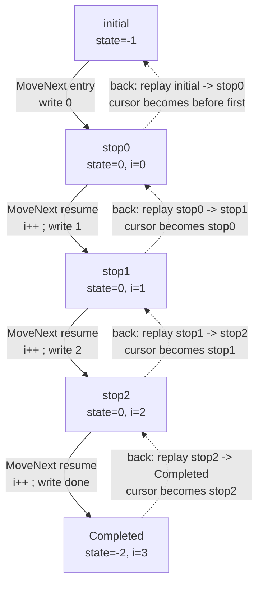
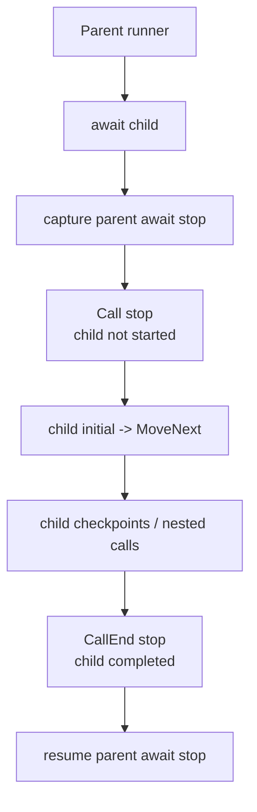

# MinimumPlayback の内部アルゴリズム

この文書では、`src/MinimumPlayback` の内部動作を説明します。C# の async 状態機械をどのように保存し、移動境界として記録し、前へ進め、後方移動のためにリプレイするのかを扱います。

`MinimumPlayback` は、checkpoint、ネストした `PlaybackTask` 呼び出し、型付き戻り値、call entry / call exit の境界、root completion、後方移動に絞った実験的な runtime です。virtual time、scheduling、`ValueTask`、一般的な `Task` semantics、user data storage は扱いません。

## 例

次のプログラムを考えます。

```csharp
using MinimumPlayback;
using static MinimumPlayback.PlaybackTask;

var playback = Playback.Create(ForScenario);

Console.WriteLine("-- forward --");
while (playback.TryMoveNext())
{
    Console.WriteLine();
}

Console.WriteLine("-- back --");
while (playback.TryMoveBack())
{
    Console.WriteLine();
}

Console.WriteLine("-- forward --");
while (playback.TryMoveNext())
{
    Console.WriteLine();
}

static async PlaybackTask ForScenario(Playback playback)
{
    for (var i = 0; i < 3; i++)
    {
        Console.Write(i);
        await Checkpoint();
    }

    Console.Write("done");
}
```

出力は次のようになります。

```text
-- forward --
0
1
2
done
-- back --
done
2
1
0
-- forward --
0
1
2
done
```

## 基本モデル

C# は `async` メソッドを `IAsyncStateMachine` に lowering します。生成された状態機械は、再開位置、ローカル変数、awaiter field、`MoveNext()` を持ちます。

`MinimumPlayback` は、この生成された状態機械を実行状態として扱います。ユーザーコードを解釈するのではなく、移動境界ごとに状態機械のスナップショットを保存し、その境界をタイムラインに記録します。

最初の `ForScenario` は、1つの生成状態機械に lowering されます。実際の名前は compiler によって変わりますが、簡略化した generated code は次の形です。

```csharp
[StructLayout(LayoutKind.Auto)]
[CompilerGenerated]
private struct ForScenarioStateMachine : IAsyncStateMachine
{
    public int state;
    public PlaybackTaskMethodBuilder builder;

    private int i;
    private CheckpointAwaitable.Awaiter checkpointAwaiter;

    private void MoveNext()
    {
        var num = state;

        try
        {
            if (num != 0)
            {
                i = 0;
                goto LoopTest;
            }

            var awaiter = checkpointAwaiter;
            checkpointAwaiter = default;
            num = state = -1;

        ResumeAfterCheckpoint:
            awaiter.GetResult();
            i++;

        LoopTest:
            if (i < 3)
            {
                Console.Write(i);
                awaiter = PlaybackTask.Checkpoint().GetAwaiter();
                if (!awaiter.IsCompleted)
                {
                    num = state = 0;
                    checkpointAwaiter = awaiter;
                    builder.AwaitUnsafeOnCompleted(ref awaiter, ref this);
                    return;
                }

                goto ResumeAfterCheckpoint;
            }

            Console.Write("done");
        }
        catch (Exception exception)
        {
            state = -2;
            builder.SetException(exception);
            return;
        }

        state = -2;
        builder.SetResult();
    }

    void IAsyncStateMachine.MoveNext() => MoveNext();

    void IAsyncStateMachine.SetStateMachine(IAsyncStateMachine stateMachine)
    {
        builder.SetStateMachine(stateMachine);
    }
}
```

生成された状態機械は、`MoveNext()` の呼び出しをまたいで次の field を保持します。

| Field | 意味 |
| --- | --- |
| `state` | compiler が使う再開位置 |
| `i` | ユーザーコードの loop 変数 |
| `checkpointAwaiter` | 中断した await の契約を表す。`GetResult()` が `await` 後の再開点で、例外を伝播し、await 結果を返す。`Checkpoint()` の結果は void だが、typed child await では同じ形で `T` を返す。 |
| `builder` | `MinimumPlayback` が実行の capture/resume に使う custom builder |

Playback は console output のような副作用を記録しません。記録するのは、生成状態機械を restore/resume できる境界です。上の例では、timeline record は次のようになります。

| Timeline record | 記録されるタイミング |
| --- | --- |
| First checkpoint | `i == 0` の状態で `await Checkpoint()` が suspend したとき |
| Second checkpoint | `i == 1` の状態で `await Checkpoint()` が suspend したとき |
| Third checkpoint | `i == 2` の状態で `await Checkpoint()` が suspend したとき |
| `Completed` | root state machine が `SetResult()` を呼んだとき |

この ordered record list を、この文書では timeline と呼びます。

この例では、各 stop は主に `(state, i)` の組に対応します。

| Boundary | `state` | `i` |
| --- | ---: | --- |
| `initial` | `-1` | undefined |
| `stop0` | `0` | `0` |
| `stop1` | `0` | `1` |
| `stop2` | `0` | `2` |
| `Completed` | `-2` | `3` |

forward / backward の違いは、どの timeline record を cursor として選ぶかに現れます。生成された `MoveNext()` は常に前向きに実行されます。



timeline 用語:

| Term | 意味 |
| --- | --- |
| Timeline | user code を実行しながら構築される ordered `PlaybackRecord[]`。 |
| Record | その ordered array に入る1つの移動境界。 |
| Boundary | `TryMoveNext()` または `TryMoveBack()` が止まれる場所。 |
| Cursor | 現在の record index。最初の record より前では `-1`。 |
| Future | cursor より後ろの record。後方移動後に truncate されることがある。 |

主な runtime object は次の3つです。

| Object | 持つもの |
| --- | --- |
| `Playback` | timeline record、record から runner への map、record から stop id への map、移動 cursor、replay/rewrite mode |
| `PlaybackRunner<TStateMachine>` | 初期状態機械のスナップショット、現在実行するスナップショット、checkpoint と parent await site で保存した `stops[]` |
| `PlaybackPromise` | 子の完了状態、親 continuation runner、親 continuation stop id |

移動中の cursor は record index です。Playback はその index から、次の前方区間を実行するために必要な状態機械 snapshot を見つけます。

| 現在の record role | 復元元 |
| --- | --- |
| 最初の record より前 (`-1`) | root runner の initial snapshot |
| `Checkpoint` | owning runner と `runner.stops[stopId]` |
| `Call` | child runner の initial snapshot |
| `CallEnd` | parent runner と `runner.stops[stopId]` |
| `Completed` | 復元元なし。root method はすでに終了している。 |

record 自体は role、label、depth、parent index を持ちます。runner と stop id は restore/replay 用の関連データとして、record index と対応づけて保存します。

## ネスト呼び出しと Call 境界

ネストした `PlaybackTask` は `Call` と `CallEnd` record を作ります。

```csharp
var playback = Playback.Create(_ => Nest(3, 3));

static async PlaybackTask Nest(int m, int n)
{
    Console.WriteLine($"[{m - n}]Entering nest({n})" + (IsForward ? " ↓" : " ↑"));
    if (n <= 0)
    {
        return;
    }

    await Nest(m, n - 1);

    Console.WriteLine($"[{m + n}]Exiting nest({n})" + (IsForward ? " ↓" : " ↑"));
}
```

前方実行の出力です。

```text
[0]Entering nest(3) ↓
[1]Entering nest(2) ↓
[2]Entering nest(1) ↓
[3]Entering nest(0) ↓
[4]Exiting nest(1) ↓
[5]Exiting nest(2) ↓
[6]Exiting nest(3) ↓
```

完了地点から後方移動すると、次のように出力されます。

```text
[6]Exiting nest(3) ↑
[5]Exiting nest(2) ↑
[4]Exiting nest(1) ↑
[3]Entering nest(0) ↑
[2]Entering nest(1) ↑
[1]Entering nest(2) ↑
[0]Entering nest(3) ↑
```

次の helper で timeline を表示できます。

```csharp
static void DumpRecord(PlaybackRecord record)
{
    Console.WriteLine(
        $"{record.Index, 3}: {string.Concat(Enumerable.Repeat("| ", record.Depth))}{record.Label} depth={record.Depth} parent={record.ParentIndex}"
    );
}

static void Dump(Playback playback)
{
    for (var i = 0; i < playback.Records.Length; i++)
    {
        DumpRecord(playback.Records[i]);
    }
}
```

timeline は次の形になります。

```text
  0: In depth=0 parent=-1
  1: | In depth=1 parent=0
  2: | | In depth=2 parent=1
  3: | | Out depth=2 parent=2
  4: | Out depth=1 parent=1
  5: Out depth=0 parent=0
  6: Completed depth=0 parent=-1
```

`Call` record があることで、子の状態機械が始まる直前に移動を止められます。`Call` から前へ進むと、子 runner の `initial` state を復元して `MoveNext()` します。さらに `CallEnd` record によって、子が完了した直後、親の await continuation が再開する直前にも止められます。



## Compiler callback から Playback runtime へ

`PlaybackTask` と `PlaybackTask<T>` は custom async method builder を使います。

```csharp
[AsyncMethodBuilder(typeof(PlaybackTaskMethodBuilder))]
public readonly partial struct PlaybackTask;

[AsyncMethodBuilder(typeof(PlaybackTaskMethodBuilder<>))]
public readonly struct PlaybackTask<T>;
```

compiler が生成する状態機械は `AsyncTaskMethodBuilder` ではなく、この custom builder を呼びます。その呼び出しは `PlaybackTaskMethodBuilderCore` に入り、生成された `MoveNext()` の実行と playback runtime state を接続します。

| 生成状態機械で起きること | Builder/runtime path | Playback effect |
| --- | --- | --- |
| async method が開始する。 | builder `Start(ref stateMachine)`。 | runner を作り、初期状態機械 snapshot を保存する。 |
| `await` が同期完了できない。 | `AwaitUnsafeOnCompleted(...)` -> `CaptureAwait(...)`。 | stop snapshot を保存し、多くの場合 timeline boundary を記録する。 |
| method が通常 return する。 | `SetResult(...)` -> runner completion。 | root なら `Completed`、child なら `CallEnd` を記録する。 |
| method が throw する。 | `SetException(...)` -> exception 付き runner completion。 | timeline path は completion と同じ。例外は promise に保存する。 |

### Async method start

生成された async method が開始すると、builder はその method の状態機械 snapshot を所有する runner を作ります。

| Step | 操作 | 目的 |
| ---: | --- | --- |
| 1 | `PlaybackRuntime.CurrentRunner` を読む。 | 親 runner を見つける。root なら `null`。 |
| 2 | `PlaybackRunner<TStateMachine>` を作る。 | 生成された状態機械を playback 実行に結びつける。 |
| 3 | runner を method promise に attach する。 | awaiter と typed result が同じ completion object を参照できるようにする。 |
| 4 | 初期状態機械のスナップショットを保存する。 | root start と `Call` replay で使う entry state を残す。 |

root method と nested method では、ここから処理が分かれます。

| Case | 操作 | 効果 |
| --- | --- | --- |
| Root method | root runner として attach し、すぐ `MoveNext()` する。 | 最初の `TryMoveNext()` がユーザーコードを最初の境界まで実行する。 |
| Nested `PlaybackTask` | child runner を持つ `Call` を記録する。 | 子が始まる前に移動を止める。子は playback が `Call` から前へ進むときだけ実行される。 |

### Await suspension

生成された `MoveNext()` が incomplete await に到達すると、次を呼びます。

```csharp
builder.AwaitUnsafeOnCompleted(ref awaiter, ref this);
```

`MinimumPlayback` はこの callback を replay 可能な状態の capture point として使います。

| Awaiter case | 保存する状態 | Timeline effect |
| --- | --- | --- |
| Replay suspension | 現在の状態機械と replay owner record index。 | 新しい record を append せず replay に戻る。 |
| Checkpoint label | 現在の状態機械を `runner.stops[]` に保存する。 | `Checkpoint` を記録または消費する。 |
| Child promise | 親の await-site 状態機械を `runner.stops[]` に保存する。 | child promise に parent continuation を登録する。 |

checkpoint capture は、ユーザーが移動できる見える stop を作ります。child-await capture は、あとで `CallEnd` が使う parent continuation stop を作ります。

### Method completion

生成された `MoveNext()` が完了すると、`builder.SetResult()` を呼びます。user code が throw した場合は、catch block が `builder.SetException(exception)` を呼びます。

どちらも runner の promise を完了させます。root runner なら `Completed` を記録します。child runner なら、登録済みの parent continuation を通して `CallEnd` を記録します。

| Runner | Completion path | Timeline effect |
| --- | --- | --- |
| Root | `MarkCompleted()`。 | `Completed` を記録または消費する。 |
| Child | promise を完了し、登録済み parent continuation を `CompleteAwait(...)` で再開する。 | `CallEnd` を記録または消費する。 |

`PlaybackRuntime` は同期的な ambient scope です。

| Slot | 意味 |
| --- | --- |
| `CurrentPlayback` | 生成された `MoveNext()` を実行中の playback instance。 |
| `CurrentRunner` | 生成された `MoveNext()` を実行中の runner。 |

runner が `MoveNext()` を呼ぶとき、自分自身を `CurrentRunner` に入れます。これにより、ネストした async method は親 runner を見つけられます。

## Timeline Records と Stop Storage

timeline record は、上の callback flow から作られます。

| Record role | 作られるタイミング | 停止位置 |
| --- | --- | --- |
| `Checkpoint` | `await Checkpoint()` の `AwaitUnsafeOnCompleted(...)`。 | checkpoint await が suspend した直後。 |
| `Call` | nested `PlaybackTask` の builder start。 | child state machine が始まる前。 |
| `CallEnd` | child の `SetResult(...)` または `SetException(...)`。 | child completion 後、parent continuation 再開前。 |
| `Completed` | root の `SetResult(...)` または `SetException(...)`。 | root completion 後。 |

保存される record は小さい value record です。

```csharp
public readonly record struct PlaybackRecord(
    int Index,
    PlaybackRecordRole Role,
    string Label,
    int Depth,
    int ParentIndex
);
```

roles:

| Role | 意味 | runtime state |
| --- | --- | --- |
| `Checkpoint` | ユーザーが明示した checkpoint | runner + stop id |
| `Call` | 子 runner の入口境界 | child runner initial state |
| `CallEnd` | 子 runner の完了境界 | parent runner + stop id |
| `Completed` | root runner の完了境界 | runner state なし |

4つの role は、いずれも移動境界です。

storage rules:

| Role | `recordRunners[index]` | `stopIdsByRecord[index]` |
| --- | --- | --- |
| `Checkpoint` | owning runner | runner-local stop id |
| `Call` | child runner | `-1` |
| `CallEnd` | parent runner | parent await stop id |
| `Completed` | `null` | `-1` |

`stopIdsByRecord` は実際の stop id をそのまま保存します。stop id がない場合は `-1` です。コード上では `NoStopId` として定義されています。`-1` sentinel は配列の resize と truncate の場所で維持されるため、restore/resume code は `stopIdsByRecord[index]` を直接使えます。

parent/depth rules:

| Role | `ParentIndex` |
| --- | --- |
| `Call` | 親となる call record。root では `-1`。 |
| `Checkpoint` | 現在の call record。root では `-1`。 |
| `CallEnd` | 完了した child call record。 |
| `Completed` | `-1`。 |

## 前方移動

`Playback.Create(...)` は entry delegate を保存します。root state machine は最初の `TryMoveNext()` で開始します。

前方移動は、現在の cursor から復元または再開し、次の timeline record が追加されるまで生成された `MoveNext()` を実行します。その後、cursor は新しい record に移ります。

後方移動の後に前へ進む場合は、まず `rewriteFrom` 以降の古い未来を truncate し、それから新しい未来を記録します。

## 後方移動

後方移動は、`IsForward == false` の状態で1つ前の前方区間を replay します。C# は生成された `MoveNext()` を通って前向きに実行されます。

| Phase | Runtime behavior |
| --- | --- |
| 区間を選ぶ。 | 現在の cursor を `target` とし、その1つ前の timeline record を探す。 |
| 復元する。 | 1つ前の record に対応する snapshot を復元する。 |
| replay する。 | `target` record が再現されるまで `MoveNext()` を前向きに実行する。 |
| cursor を動かす。 | 再現された `target` を消費し、cursor を1つ前の record に移す。 |
| rewrite を準備する。 | 新しい cursor より後ろの record を、次の前方移動で truncate する未来として扱う。 |

replay 中に追加されようとする record は、次の既存 record と一致しなければなりません。role や label が違う場合、状態機械の実行と timeline が一致していません。

## 型付き結果、例外、Clone

`PlaybackPromise<T>` は、child completion から parent awaiter へ typed result を渡します。

child completion を replay する前に、promise の completion state を reset します。

| Promise field | Replay reset |
| --- | --- |
| `completed` | `false` |
| `exception` | `null` |

continuation runner と stop id の link は残します。これにより、replay された child completion は同じ `CallEnd` を記録し、同じ parent await state を再開できます。

例外は promise に保存され、`GetResult()` から throw されます。

### Debug State-Machine Cloning

Release build では、compiler 生成の async state machine は一般に value type です。代入で状態機械そのものがコピーされます。

Debug build では、state machine が reference type になることがあります。通常の代入では参照だけがコピーされるため、過去の checkpoint を復元しても、すでに mutation 済みの状態を見てしまいます。

`MinimumPlayback` は reference-type state machine に shallow clone helper を使います。

```csharp
private static TStateMachine SnapshotStateMachine(TStateMachine source)
{
    if (typeof(TStateMachine).IsValueType)
        return source;

    if (source == null)
        throw new InvalidOperationException("State machine is null.");

    return CloneUtility.Clone(source);
}
```

helper は reference-type state machine を `MemberwiseClone()` に通します。

```csharp
internal class CloneUtility
{
    public static T Clone<T>(T obj)
    {
        var cloneable = Unsafe.As<T, CloneUtility>(ref obj);
        return (T)cloneable.MemberwiseClone();
    }
}
```

この clone は shallow clone です。compiler state-machine field はコピーしますが、local が参照している任意の mutable object までは deep copy しません。

## 制約

| 制約 | 意味 |
| --- | --- |
| single-threaded runtime | 移動は明示的な playback call によって進む。 |
| `PlaybackTask` model | `PlaybackTask` / `PlaybackTask<T>` を扱い、`ValueTask` や一般的な `Task` は扱わない。 |
| child task ごとに1つの parent await site | child promise は1つの parent continuation を保持する。 |
| reference-type state machine は shallow clone | Debug の reference-type state machine は shallow clone する。 |
| linear timeline lookup | next/previous record lookup は timeline record を scan する。 |
